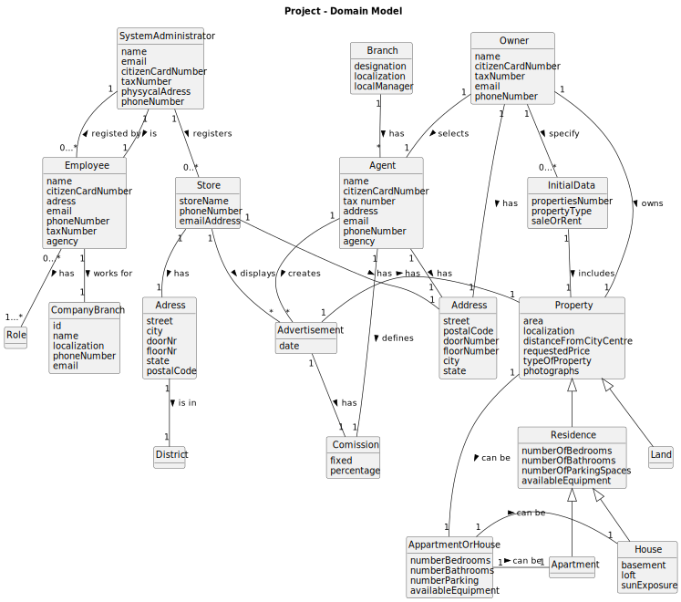

# Analysis

## Rationale to identify domain conceptual classes ##

### _Conceptual Class Category List_ ###

**Business Transactions**

* 

**Transaction Line Items**

* House
* Apartment
* Land

---

**Product/Service related to a Transaction or Transaction Line Item**

*  

---

**Transaction Records**

*  

---  

**Roles of People or Organizations**

* System Administrator
* Agent
* Owner
* Store
* Client
* Unregistered user

---

**Places**

* Property 
* Store 
* Residence
* House
* Adress

---

**Noteworthy Events**

* Announcement
* Visit

---

**Physical Objects**

* House
* Apartment
* Store

---

**Descriptions of Things**

* Announcement
* Type of property

---

**Catalogs**

*  

---

**Containers**

* Property

---

**Elements of Containers**

* House
* Apartment
* Land

---

**Organizations**

*  

---

**Other External/Collaborating Systems**

*  

---

**Records of finance, work, contracts, legal matters**

* 

---

**Financial Instruments**

*  

---

**Documents mentioned/used to perform some work**

*

---

###**Rationale to identify associations between conceptual classes**###

An association is a relationship between instances of objects that indicates a relevant connection and that is worth of remembering, or it is derivable from the List of Common Associations: 

+ **_Visit_** is about **_Property_**
+ **_Announcement_** is about **_Property_**
+ **_Property_** has **_Owner_**
+ **_Property_** has **_Agent_**
+ **_Property_** is **_House_** or **_Apartment_**
+ **_Property_** is located at **_Adress_**
+ **_Agent_** approves **_Visit_**
+ **_Agent_** publishes **_Announcement_**
+ **_Agent_** is **_Employee_**
+ **_System Admin_** registers **_Store_**
+ **_System Admin_** registers **_Employee_**
+ **_Store_** has **_Employee_**
+ **_A_** is **_B_**
+ etc.

| Concept (A) 		  |              Association   	              |                                   Concept (B) |
|-----------------|:-----------------------------------------:|----------------------------------------------:|
| Visit  	        |             is about    		 	              |                                      Property |
| Announcement  	 |             is about    		 	              |                                      Property |
| Property  	     |  has   has  is   is    		 	   | Owner   Agent   House   Apartment |
| Agent  	        | approves   publishes   is    		 	 |       Visit   Announcement   Employee |
| System Admin  	 |             registers    		 	             |                          Store   Employee |
| Store  	        |                has    		 	                |                                      Employee |
| ...  	          |                ...    		 	                |                                           ... |
| ...  	          |                ...    		 	                |                                           ... |

## Domain Model

