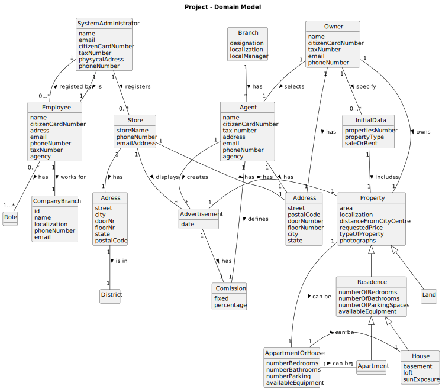

# Analysis

## Rationale to identify domain conceptual classes ##

### _Conceptual Class Category List_ ###

**Business Transactions**

* 

**Transaction Line Items**

* House
* Apartment
* Land

---

**Product/Service related to a Transaction or Transaction Line Item**

*  

---

**Transaction Records**

*  

---  

**Roles of People or Organizations**

* System Administrator
* Agent
* Owner
* Store
* Client
* Unregistered user

---

**Places**

* Property 
* Store 
* Residence
* House
* Adress

---

**Noteworthy Events**

* Announcement
* Visit

---

**Physical Objects**

* House
* Apartment
* Store

---

**Descriptions of Things**

* Announcement
* Type of property

---

**Catalogs**

*  

---

**Containers**

* Property

---

**Elements of Containers**

* House
* Apartment
* Land

---

**Organizations**

*  

---

**Other External/Collaborating Systems**

*  

---

**Records of finance, work, contracts, legal matters**

* 

---

**Financial Instruments**

*  

---

**Documents mentioned/used to perform some work**

* 
---

###**Rationale to identify associations between conceptual classes**###

An association is a relationship between instances of objects that indicates a relevant connection and that is worth of remembering, or it is derivable from the List of Common Associations: 

+ **_Adress_** is physically or logically part of **_Property_**
+ **_Property_** is physically or logically contained in/on **_Adress_**
+ **_A_** is a description for **_B_**
+ **_A_** known/logged/recorded/reported/captured in **_B_**
+ **_Owner_** uses or manages or owns **_Property_**
+ **_A_** is related with a transaction (item) of **_B_**
+ etc.

| Concept (A) 		|  Association   	|  Concept (B) |
|----------	   		|:-------------:		|------:       |
| C1  	| verb1    		 	| C2  |
| ...  	| ...    		 	| ...  |

## Domain Model

