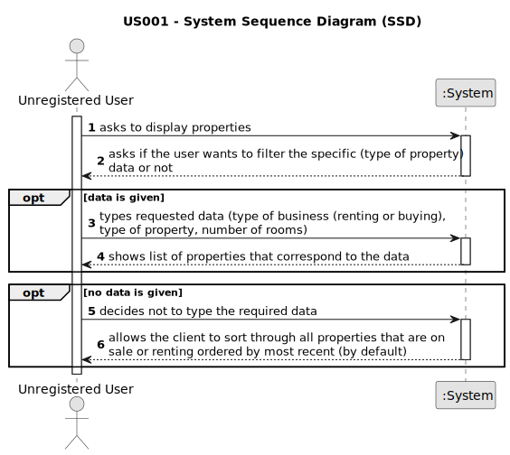

# US 001

## 1. Requirements Engineering

### 1.1. User Story Description

As an unregistered user, I want to display listed properties.

### 1.2. Customer Specifications and Clarifications 

**From the specifications document:**

> The real estate agent reviews advertisement requests (...) it is **visible to all clients** who visit the agency and use the application.

> All registered information, except the agency commission, can be accessed by the client who intends to buy or rent the property.

**From the client clarifications:**

> **Question:** In the project's documentation it is mentioned that "All those who wish to use the application must be authenticated", but in the US1 it said that an unregistered user can see a list of properties. Can users who aren't authenticated do this?
>  
> **Answer:** Non-authenticated users can only list properties.

> **Question:** Can the properties be listed for sale and lease at the same time?
>  
> **Answer:** No.

> **Question:** In the project description it is stated that "the client is, then, responsible for being able to consult the properties by type, number of rooms, and sort by criteria such as price or the parish where the property is located.". Is the client able to sort properties by only these 4 criteria or is he able to sort properties by any of the properties' characteristics?
>
> **Answer:** The client should be able to select the type of business (renting or buying), the type of property and the number of rooms. Then, the client should be able to sort properties by price or by parish where the property is located. If the client does not select the type of business, the type of property and the number of rooms, the application should allow the client to sort all properties that are on sale or on renting.

> **Question:** Can an unregistered user olny see sale announcements or is he able to contact the agency agents to make a purchase request?
>
> **Answer:** From the project description: "As an unregistered user, I want to display listed properties". For now, this is the only functionality of the system that the non-registered user can use.

> **Question:** When an unregistered user opens the application, are there already properties being listed? If the answer is "YES": then by default, by which criteria are the properties listed? If the answer is "NO": is it mandatory for the user to choose an option (type, number of rooms) or can he/her simply request to view a list of properties that will be automatically ordered, for example, by "most recent"?
>
> **Answer:** If the system does not contain any properties, the system should show an empty list of properties.

> **Question:** When a unregistered user wants to list properties, the list given by the program is sorted by default with which criteria? For example the list is shown with the properties sorted by most recently added?
>
> **Answer:** By default, the list should be shown with the properties sorted by most recently added.

> **Question:** Can a user filter the properties list for example by a type but choosing multiple values? For example the users wants to see only properties with 3 or 4 rooms. If this is possible, after filtering the list to show only the values chosen, he can sort by ascending/descending?
>
> **Answer:** The user should select only one value for each feature of the property. By default, the list should be shown with the properties sorted by most recently added.

> **Question:** One of the search criteria is "number of rooms". Is that "Number of Bedrooms", "Number of Bathrooms" or both?
>
> **Answer:** Number of Bedrooms.

### 1.3. Acceptance Criteria

* *AC1:* Not all required fiels must be filled in.
* *AC2:* There must be at least one listed property to list the properties. Else, it displays no properties.

### 1.4. Found out Dependencies

* There could be a dependency in US002 since publishing a sale announcement would eventually require the listed properties to be shown.

### 1.5 Input and Output Data

**Input Data:**

* Typed data:
	* sale/rental
	* area
	* distance from center
	* price
	* property type
		* apartment
			* number of bedrooms
			* number of bathrooms
			* number of parking spaces
			* available equipment
		* house
			* number of bedrooms
			* number of bathrooms
			* number of parking spaces
			* available equipment
			* existence of a sun exposure
			* existence of a basement
			* existence of an inhabitable loft

**Output Data:**

* Listed properties that correspond to the inserted data or (by default) from most recently added.

### 1.6. System Sequence Diagram (SSD)

### 1.7 Other Relevant Remarks