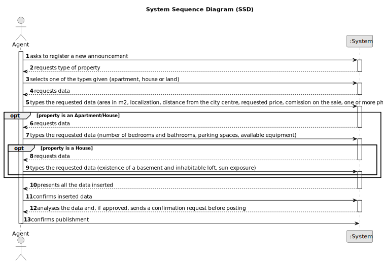

# US 002 - Publish a sale announcement

## 1. Requirements Engineering

### 1.1. User Story Description

As an agent, I can publish any sale announcement on the system, for example received through a phone call.

### 1.2. Customer Specifications and Clarifications 

**From the specifications document:**

>	Each task is characterized by having a unique reference per organization, a designation, an informal and a technical description, an estimated duration and cost as well as the its classifying task category. 

>	As long as it is not published, access to the task is exclusive to the employees of the respective organization. 

**From the client clarifications:**

> **Question:** We are having a little issue defining what the sun exposure might be. We are not sure what it will be as a value. If it's a number that defines how much exposure the house has or if it is just a text saying if it has or hasn't sun exposure.
>  
> **Answer:** Sun exposure will take the following values: North, South, East, or West.

> **Question:** Is the phone call the only way the agent can receive the sale announcement? Or he can receive them via e-mail/letter/etc?
>  
> **Answer:** For now this is the only way.

> **Question:**
> 
> **Answer:**

### 1.3. Acceptance Criteria

* **AC1:** All required fiels must be filled in.
* **AC2:** Task reference must have at least 5 alphanumeric chars.
* **AC3:** When creating a task with an already existing reference, the system must reject such operation and the user must have the change to modify the typed reference.

### 1.4. Found out Dependencies

* There are no dependencies

### 1.5 Input and Output Data

**Input Data:**

* Typed data:
    * Area in m2
    * Location
    * Distance from the city centre
    * Requested price
    * One or more photographs
    * Number of bedrooms
    * Number of bathrooms
    * Number of parking spaces
    * Available equipment
    * Comission
	
* Selected data:
	* Type of property
    * Existence of a basement
    * Existence of an inhabitable loft
    * Sun exposure

**Output Data:**

* All the data
* Confirmation request

### 1.6. System Sequence Diagram (SSD)

### 1.7 Other Relevant Remarks