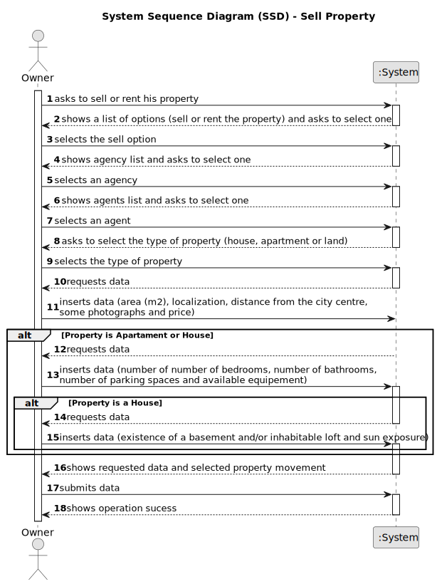

# US 004 - 

## 1. Requirements Engineering

### 1.1. User Story Description

As an owner, I intend to submit a request for listing a property sale or rent, choosing the responsible agent.

### 1.2. Customer Specifications and Clarifications 

**From the specifications document:**

> Owner can use the application to sell or rent one or more properties
> The owner must provide property characteristics and the requested price
> The request is sent to an agent of their choosing

> If the owner wants to sell a property, he must provide information about the type of property (apartment, house or land), the area (m2), location, distance from city centre, price and photos
 
> For apartments and houses, the owner must also provide the number of bedrooms, bathrooms and parking spaces, as well as any available equipment (central heating and/or air conditioning)

> For houses the owner must additionally register the existence of a basement, inhabitable loft and also register sun exposure

**From the client clarifications:**

> **Question:** We are having a little issue defining what the sun exposure might be. We are not sure what it will be as a value. If it's a number that defines how much exposure the house has or if it is jusr a text saying if it has or hasn't sun exposure.
>  
> **Answer:** Sun exposure will take the following values: North, South, East or West.

> **Question:** In the Project description, there are only specifications for a sale. What are the required characteristics for a rental?
>  
> **Answer:** The characteristics for a rental are the same as the ones for the sale of a property. The rent value is per month. Additionally, we have to define the contract duration.

> **Question:** Are there any restrictions on the choice of an Agent
>
> **Answer:** No

> **Question:** In case the submission of the listing is online may the owner choose any agent?
>
> **Answer:** Yes.

> **Question:** Is it possible to submit multiple listing for the same property and type of listing?
>
> **Answer:** No

> **Question:** Does that imply that a seller can choose the agency/branch/store independently of the location of the property?
>
> **Answer:** Yes

> **Question:** Also another question, when publishing a property, if the owner leaves the listing unfinished, can it be saved or stay as a sketch to be finished later?
>
> **Answer:** No

> **Question:** When assigning an agent to a property listing, are the available agents shown by the system for the owner to pick? Or does the owner need to provide the agent's information (name, agency, etc)?
>
> **Answer:** The owner should select one agent from a list of agents that work in the selected agency. The owner should select the agency before selecting the agent.

> **Question:** Does an owner need to be registered in the system to submit a request for a property listing?
> 
> **Answer:** No. When making the request to list a property, the owner should introduce his own data. The Owner attributes are: the name, the citizen's card number, the tax number, the address, the email address and the telephone number.

> **Question:** Is there a designated currency for this business, or should we use USD?
>
> **Answer:** Please use USD.

### 1.3. Acceptance Criteria

* **AC1:** The owner must provide properties type, area, location, distance from the city centre, photos and price
* **AC2:** For rents, the owner must also provide the price (per month) and the contract duration 
* **AC3:** For houses or apartments, the owner must aditionally provide the number os bedrooms, bathrooms and parking spaces, as well as any available equipment
* **AC4:** For houses, the owner provide info on the existence of a basement, inhabitable loft, as well as the sun exposure

### 1.4. Found out Dependencies

* There is a dependency to "US003" since at least an agent must be registered for owner to select.

### 1.5 Input and Output Data

**Input Data:**

* Typed data:
	* a reference, 
	* a designation, 
	* an informal description
	* a technical description
	* an estimated duration
	* an estimated cost
	
* Selected data:
	* Classifying task category 

**Output Data:**

* List of existing task categories
* (In)Success of the operation

### 1.6. System Sequence Diagram (SSD)

**Other alternatives might exist.**

#### Property Rent

#### Property Sell

### 1.7 Other Relevant Remarks

* The created task stays in a "not published" state in order to distinguish from "published" tasks.