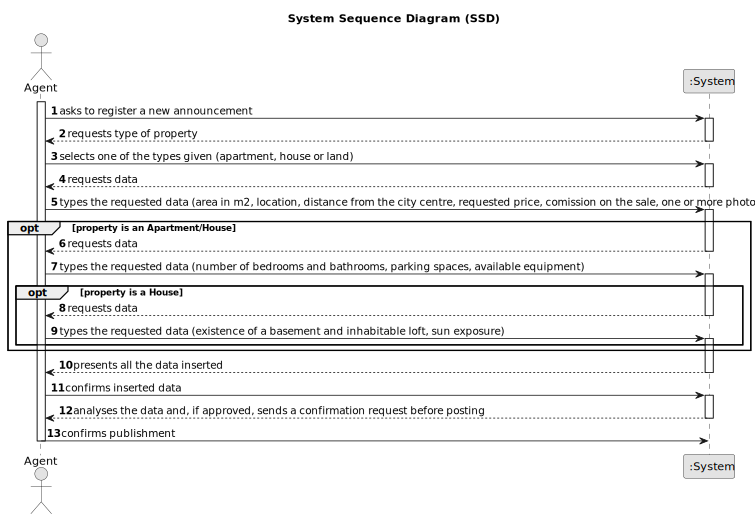

# US 002 - Publish a sale announcement

## 1. Requirements Engineering

### 1.1. User Story Description

As an agent, I can publish any sale announcement on the system, for example received through a phone call.

### 1.2. Customer Specifications and Clarifications 

**From the specifications document:**

> “Upon receiving the order, the agent sets the commission and publishes the offer in the system. The commission can be a fixed amount or a percentage. In the case of a request for the sale of a property, the owner must provide information on: the type of property (apartment, house or land), the area in m2, the location, the distance from the city center, the requested price and one or more photographs. If the property is an apartment or a house, the owner also provides: the number of bedrooms, the number of bathrooms, the number of parking spaces and the available equipment, such as central heating and/or air conditioning. In case the property is a house, the existence of a basement, an inhabitable loft, and sun exposure must be registered as well.”

> "The real estate agent reviews advertisement requests, registers the information in the system and publishes the offer so that it is visible to all clients who visit the agency and use the application."

**From the client clarifications:**

> **Question:** How does the agent determine whether it is a fixed commission or a percentage commission?
> 
> **Answer:** The agent should choose the type of commission and enter the value.

> **Question:** The act of publishing a sale announcement means that the agent is publishing a new property for sale in the system (receiving the information of the seller and publishing the new property for sale) or is it the buyer giving positive feedback to the agent with intent to buy the property(actually closing a sale, buying a property and de-listing said property)?
>
> **Answer:** In US1 we get "As an agent, I can publish any sale announcement on the system, for example received through a phone call". Additional information related with this question is also avaliable in the project description. Asking the customer something that is clear or has already been clarified is unprofessional.

> **Question:** What would be the attributes of the Owner and Agent?
>
> **Answer:** The Owner attributes are: the name, the citizen's card number, the tax number, the address, the email address and the contact telephone number. The Agent is an employee of the company.

> **Question:** Is there a designated currency for this business, or should we use USD?
>
> **Answer:** Please use USD.

> **Question:** Should we consider that, until the request is reviewed and posted, the request stays in a "not published" state?
>
> **Answer:** This is an implementation detail. For me, as a client, I want the feature implemented as I already described in the project description.

> **Question:** When the request arrives at the agent, are all the essential characteristics of the property in question already present?
>
> **Answer:** Yes.

> **Question:** According to the Project Description, the agent when selling a property can charge a flat price comission or a percentage of the sale value, my question here is wether there is a minimum and/or a maximum to each of these types of comissions?
>
> **Answer:** There is no maximum and the minimum is 0.

> **Question:** So, my question is that, if this interpretation is correct, does the agent actually have two ways of publishing the sales announcement, one where he inputs everything directly with the owners assistance (owner goes to a company branch), and another where he just takes information already in the system, adds the commission data, and then publishes it as a sales announcement instead of a property listing.
>
> **Answer:** In US2 we get "As an agent, I can publish any sale announcement on the system, for example received through a phone call". This will be a feature/functionality of the system. The agent may receive the information by any means.

> **Question:** Is it necessary to publish the owner atributes on the sale announcement?
>
> **Answer:** No.

> **Question:** About the agent comission. What is the value for the fixed amount comission? Is it the same for all agents?
>
> **Answer:** The commission is for the agency and for that given property.

> **Question:** If it's a property for lease is the comission value adjusted for the monthly value and contract duration? What is the value or method for calculating the comission?
>
> **Answer:** The commission is one value/percentage paid when the transaction is made.

> **Question:** Is it mandatory for the agent to input the commission value before publishing an announcement?
>
> **Answer:** Yes.

> **Question:** Are there only 2 types of commission or can the Administrator define more types of commission?
>
> **Answer:** For now we only have two types of commissions.

> **Question:** Also, since the only way that an agent can receive sale announcement request is through a phone call, wouldn't that contradict what was stated in the project description: "Owners go to one of the company's branches and meet with a real estate agent to sell or rent one or more properties, or they can use the company's application for the same purposes."?
>
> **Answer:** US2: As an agent, I can publish any sale announcement on the system, for example received through a phone call. For example...

> **Question:** In USS02 are all the criteria for publishing the sale of a property in the system mandatory, or is there any data that the owner can choose not to give? such as not saying the direction of sun exposure in the case of a house.
>
> **Answer:** The number of bathrooms, the available equipment and the sun exposure are not mandatory. At least one photograph is required.

> **Question:** What are the attributes of an announcement? Should the announcement have a publication date, and a defined type of announcement embeded (sale or rent)?
>
> **Answer:** Please check the project description available in moodle. Please show the publication date.

> **Question:** When the agent receives the phone call (as mentioned in US002) is it the agent who registers the order in the system or has the order already been entered into the system by the owner? Or is the phone call just for the owner to tell the agent that he registered a request in the system?
>
> **Answer:** The agent registers the order in the system.

### 1.3. Acceptance Criteria

* **AC1:** The user must be a real estate agent to proceed with a properrty registration.
* **AC2:** All required fields must be filled in.
* **AC3:** The property can't already exist in the system.

### 1.4. Found out Dependencies

* US3
* US4 

### 1.5 Input and Output Data

**Input Data:**

* Typed data:
    * Comission
	
* Selected data:
	* Comission type

**Output Data:**

* All the data
* Available announcements
* Sucess message

### 1.6. System Sequence Diagram (SSD)

### 1.7 Other Relevant Remarks