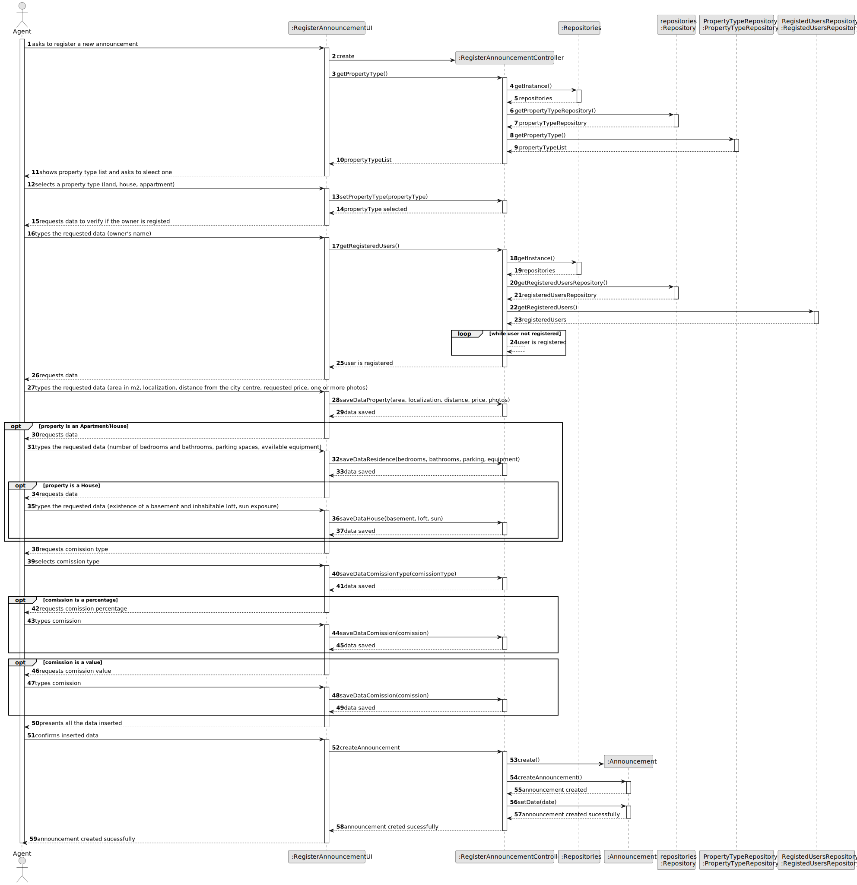
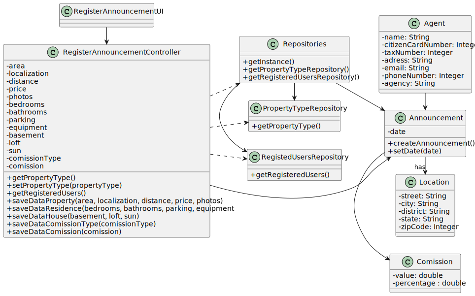

# US 002 - Publish a sale announcement

## 3. Design - User Story Realization 

### 3.1. Rationale

**SSD**

| Interaction ID                                                                                                      | Question: Which class is responsible for... | Answer       | Justification (with patterns)                                                                                 |
|:--------------------------------------------------------------------------------------------------------------------|:--------------------------------------------|:-------------|:--------------------------------------------------------------------------------------------------------------|
| Asks to register a new announcement                                                                                 | 	... interacting with the actor?            | CreateTaskUI | Pure Fabrication: there is no reason to assign this responsibility to any existing class in the Domain Model. |
| Selects a property type (land, house, appartment)                                                                   | 	                                           |              |                                                                                                               |
| types the requested data (owner's name)                                                                             | 	... instantiating a new Task?              | Organization | Creator (Rule 1): in the DM Organization has a Task.                                                          |
| types the requested data (area in m2, location, distance from the city centre, requested price, one or more photos) | ... knowing the user using the system?      | UserSession  | IE: cf. A&A component documentation.                                                                          |
| types the requested data (number of bedrooms and bathrooms, parking spaces, available equipment)                    | 							                                     | Organization | IE: knows/has its own Employees                                                                               |
| selects comission type                                                                                              | 							                                     | Employee     | IE: knows its own data (e.g. email)                                                                           |
| requests comission percentage                                                                                       | 							                                     |              |                                                                                                               |
| confirms inserted data                                                                                              | 	...saving the inputted data?               | Task         | IE: object created in step 1 has its own data.                                                                |
|                                                                                                                     | 	                                           |              |                                                                                                               |

### Systematization ##

According to the taken rationale, the conceptual classes promoted to software classes are: 

 * Organization
 * Task

Other software classes (i.e. Pure Fabrication) identified: 

 * CreateTaskUI  
 * CreateTaskController

## 3.2. Sequence Diagram (SD)

This diagram shows the full sequence of interactions between the classes involved in the realization of this user story.

## 3.3. Class Diagram (CD)

