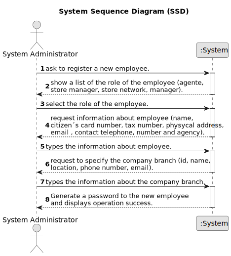

# US 003 - To register an employee

## 1. Requirements Engineering

### 1.1. User Story Description

As an organization employee, I want to register a new employee .

### 1.2. Customer Specifications and Clarifications

**From the specifications document:**

> Each employee is characterized by the name, passport card number, the tax number, the adress, the email address, the telephone number and the agency to which it is assigned.
> Each employee has his own role.
> For each employee a random password is generated for him.

**From the client clarifications:**

> **Question:** The administrator when registering a new employee will also have to specify the category/office that he will perfom ?
>
> **Answer:** The administrator has to specify the role of the employee.

> **Question:** When a System Administrator (admin) makes a request to register a new employee or a new network branch (or any other alteration), does the System ask for the admin credentials (login, password)?
>
> **Answer:** The System Administrator should be logged in the application.

> **Question:** When registering a new employee, will the administrator set the respective employee password?
> 
> **Answer:** The password should have eight characters in length and should be generated automatically. The password is sent to the employee by e-mail.

> **Question:** Does the System Administrator have permission to create, edit, delete, or just create new employee registrations?
>
> **Answer:** For now, the System Administrator can only do what is specified in the Project Requirements.

> **Question:** Can an employee be registered to more than one agency?
>
> **Answer:** No.

> **Question:**  What would be the attributes of the System Administrator, Agency and the Roles?
> 
> **Answer:** The System Administrator is an employee. You can get the roles from the project description. Please check the project description.
Moreover, I just answered a question to clarify what are the attributes of an agency/store.

> **Question:** The statement specifies 3 different types of employees. 
The admnistrator, the agent and the store manager. Do we consider that there are only that  functions for employees or are there more?
>
> **Answer:** On this subject everything has already been clarified. 
Please check the project description and the posts I wrote in this forum.

> **Question:** To register a system administrator, beyond the characteristics already defined on project description, the system administrator should have a list of the agencys available?
> 
> **Answer:** I do not understand your question.

> **Question:**  According to the statement, the administrator has to clarify the citizen's card number, but what card is it? In the US, there is no identification card, so is it referring to the passport?
>
> **Answer:** You are correct. The citizen card number should be replaced by the passport card number.

> **Question:** he statement specifies 3 different types of employees. The admnistrator, the agent and the store manager. Do we consider that there are only that functions for employees or are there more?
> 
> **Answer:** On this subject everything has already been clarified. Please check the project description and the posts I wrote in this forum.

> **Question:** To register a system administrator, beyond the characteristics already defined on project description, the system administrator should have a list of the agencys available?
> 
> **Answer:** I do not understand your question.

> **Question:**  I have a question related to the output data: when the system administrator is registering a new employee are we free to display what we feel is important or should a specific message be shown? I was thinking of displaying whether the operation was successful or not, is that fine or should something else be displayed as well?
> 
> **Answer:** A good pratice is to show the information and ask for confirmation.

> **Question:** You have stated before that name, cc number, tax number, email address, phone number and the assigned agency of the employee are the mandatory requirements to register a new one, leaving out the employee's adress and role.  
This confused me, because it wasn't clear whether leaving out those two characteristics from the answer was intentional or not. Futhermore, the role of the employee seems like too much of an important piece of information to be left out. My request is, then, for you to state whether or not that was a conscious decision in your answer.
> **Answer:** The role is required.

> **Question:**  You've stated previously that an employee can only be registered to one agency so what happens if an employee wants/has to change agencies and needs to be registered to a new one? Should the system reject such operation or should the employee's previous registration be deleted?
>
> **Answer:**  For now I do not want such features to be included in the system. I will discuss your suggestion with the company shareholders and I will come back here if we decide to include such features in the system.

> **Question:** When registering a new employee, all the required data (name, citizen's card number, etc...) have to be filled or exists not mandatory data?
> 
> **Answer:** Required/Mandatory data that should be filled when registering an employee: name, the citizen's card number, the tax number, the email address, the contact telephone number and the agency to which it is assigned.

> **Question:** However, it was replied to a question when a new Employee is created in the system, that a 8 digit Password should be automatically generated. How many digits should we go forward for password length validation in your software? And please confirm required special characters, etc.
> 
> **Answer:** Sorry, I completely forgot that all our authentication systems require passwords with seven alphanumeric characters in length , including three capital letters and two digits. The password should be generated automatically. The password is sent to the employee by e-mail.

> **Question:** Does the system administrator select the agency to which the employee is assigned and his role from a list? Or does he just type that data?
> 
> **Answer:** The System Administrator should select.

### 1.3. Acceptance Criteria

* **AC1:** The password of the new employee should have eight characters in length.
* **AC2**: The name entered must be valid. 
* **AC3**: The citizen´s card number entered must be valid.
* **AC4**: The tax number entered must be valid.
* **AC5**: The adress entered must be valid.
* **AC6**: The email adress entered must be valid.
* **AC7**: The contact telephone number entered must be valid.
* **AC8**: The agency entered must be valid.
* **AC9**: The designation entered must be valid.
* **AC10**: The location entered must be valid.
* **AC11**: The local manager entered must be valid.

### 1.4. Found out Dependencies

* There is a dependency to "US005 Register a store " because you need a store to be possible to register an employee.

### 1.5 Input and Output Data
**Input Data:**

* Typed data:
    * the name of the employee
    * the citizen number of the employee
    * the tax number of the employee
    * the adress of the employee
    * the email address of the employee
    * the telephone number of the employee
    * the agency to which the employee is assigned.
    * the location of employee
    * the local manager
  
   

* Selected data:
    * Classifying the role of the employee

**Output Data:**

* list of all registered employees
* Generate a passoword to the new employee
* (In)Success of the operation

### 1.6. System Sequence Diagram (SSD)

### 1.7 Other Relevant Remarks

* The state of the employee stays in "unregisterd" state in order to distinguish from "registered" state.
* Only the system administrator can register a new employee.