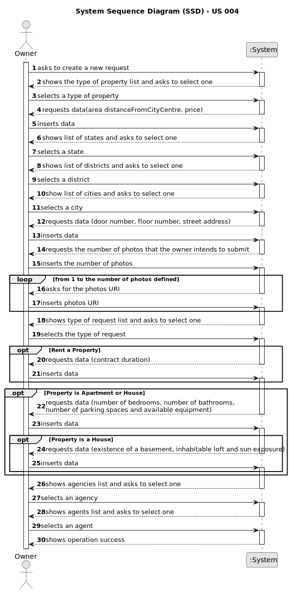

# US 004 - Readme

## 1. Requirements Engineering

### 1.1. User Story Description

As an owner, I intend to submit a request for listing a property sale or rent, choosing the responsible agent.

### 1.2. Customer Specifications and Clarifications 

**From the specifications document:**

 From time to time, property owners contact Real Estate USA with the aim of selling or renting their
properties. Owners go to one of the company's branches and meet with a real estate agent to sell or
rent one or more properties, or they can use the company's application for the same purposes. The
owner provides property characteristics and the requested price and sends the request to an agent.
 
In the case of a request for the sale of a property, the owner must provide information on: the type of property (apartment, house or land),
the area in m2, the localization, the distance from the city centre, the requested price and one or more
photographs. 
 
If the property is an apartment or a house, the owner also provides: the number of
bedrooms, the number of bathrooms, the number of parking spaces and the available equipment,
such as central heating and/or air conditioning. 
 
In case the property is a house, the existence of a
basement, an inhabitable loft, and sun exposure must be registered as well.

**From the client clarifications:**
> **Question:** We are having a little issue defining what the sun exposure might be. We are not sure what it will be as a value. If it's a number that defines how much exposure the house has or if it is just a text saying if it has or hasn't sun exposure. 
> 
> **Answer (17 March 2023):** Sun exposure will take the following values: North, South, East or West.

> **Question:** In the Project description, there are only specifications for a sale. What are the required characteristics for a rental?
>  
> **Answer (17 March 2023):** The characteristics for a rental are the same as the ones for the sale of a property. The rent value is per month. Additionally, we have to define the contract duration.

> **Question:** Are there any restrictions on the choice of an Agent
>
> **Answer (17 March 2023):** No

> **Question:** In case the submission of the listing is online may the owner choose any agent?
>
> **Answer (17 March 2023):** Yes.

> **Question:** Is it possible to submit multiple listing for the same property and type of listing?
>
> **Answer (20 March 2023):** No

> **Question:** Does that imply that a seller can choose the agency/branch/store independently of the localization of the property?
>
> **Answer (20 March 2023):** Yes

> **Question:** Also another question, when publishing a property, if the owner leaves the listing unfinished, can it be saved or stay as a sketch to be finished later?
>
> **Answer (20 March 2023):** No

> **Question:** When assigning an agent to a property listing, are the available agents shown by the system for the owner to pick? Or does the owner need to provide the agent's information (name, agency, etc)?
>
> **Answer (23 March 2023):** The owner should select one agent from a list of agents that work in the selected agency. The owner should select the agency before selecting the agent.

> **Question:** Does an owner need to be registered in the system to submit a request for a property listing?
> 
> **Answer (23 March 2023):** No. When making the request to list a property, the owner should introduce his own data. The Owner attributes are: the name, the citizen's card number, the tax number, the address, the email address and the telephone number.

> **Question:** Is there a designated currency for this business, or should we use USD?
>
> **Answer (23 March 2023):** Please use USD.

> **Question:** In the case of listing a land property, shall the owner refer if there is a building permit already approved?
> **Answer (23 March 2023):** No.

> **Question (28 March 2023):** When renting does the owner have any space to clarify any prohibitions or obligations with the property?
> 
> **Answer:** No.

> **Question (28 March 2023):** Does the owner have a limit of requests they can do?
> 
> **Answer:** No.

> **Question:** Regarding the property's photographs, is that considered selected data?
> 
> **Answer (28 March 2023):** The owner should input the URI of each file/photograph.

> **Question:** In one of the previous questions you have stated that for now the only way that an agent can receive the sale announcement request is through a phone call. However, US004 states that "As an owner, I intend to submit a request for listing a property sale or rent, choosing the responsible agent". Isn't submitting a request for listing a property the same as a sale announcement request? If not, can you clarify?
> 
> **Answer (29 March 2023):** In my previous answer, when I said "...the only way that an agent can receive the sale announcement..." I was talking about the agent as an actor of the system that introduces in the system property data.

> **Question:** Is the owner able to edit an already active listing of a property? If so, do the edits need to be accepted by the agent before being published?
> 
> **Answer (24 April 2023):** No.

> **Question:**  When the owner is going to make the request for listing a property for sale or rent, is he (owner) already registered in the system? If yes, before placing the order, does he need to enter any of his data, for example, email address?
> 
> **Answer (24 April 2023):**  Yes. The data is available in the system.

> **Question:** It was previously stated that an unregistered user could do a property listing request. However, with the introduction of US007, I want to clarify and make sure that now a user needs to be registered in order to buy, sell or rent properties, or if they can still do it unregistered.
> 
> **Answer (15 April 2023):** In Sprint B we introduce US7 and now, in US4, the owner needs to be registered in the system to submit a request for listing. You should update all artifacts to include this change.

> **Question:** In the project description it is mentioned that in the case of a request for the sale of a property, the owner must provide "one or more photographs". Taking that into account, is there a maximum number of photos that can be submitted when publishing an announcement? If so, how many?
> 
> **Answer (20 April 2023):** The maximum number of photos is 30.

### 1.3. Acceptance Criteria

* **AC1**: All required files must be filled in.
* **AC2**: Must be provided the type of property.
* **AC3**: The area must be in m^2.
* **AC4**: The localization and the distance from the city centre must be known.
* **AC5**: Must have the requested price and one or more photographs.
* **AC6**: The photos must be in URI format.
* **AC7**: The prices must be in USD currency.

### 1.4. Found out Dependencies

* There is dependency to the "US3 - register an employee" since that has to be, at least one employee to review the advertisement request, the "US5-register a store" since that has to be , at least, one store (agency) to be selected by the owner, to the "US6-specify states, districts and cities in the System" since that the property listed by the owner has an address (is in a state, in a district and in a city) and to the "US7 -  want to register in the system to buy, sell or rent
  properties."

### 1.5 Input and Output Data

**Input Data:**

* Typed data:

	* Property Data:
		* the area in m2
		* the address
		* the distance from the city centre
		* the requested price
		* one or more photographs in URI

		* Additional Data for apartment or a house:
			* the number of bedrooms
			* the number of bathrooms
			* the number of parking spaces
			* the available equipment:
               * central heating
               * air conditioning

		* Additional Data for house:
			* the existence of a basement
			* an inhabitable loft

* Selected data:
	* Listing options (rent or sale)
	* The type property (apartment, house or land)
	* The Agency
	* The Agent
    * Sun exposure

**Output Data:**
* Listing options (rent or sale)
* Type of properties (apartment, house or land)
* List of Agencies
* List of Agents
* (In)Success of the operation

### 1.6. System Sequence Diagram (SSD)

