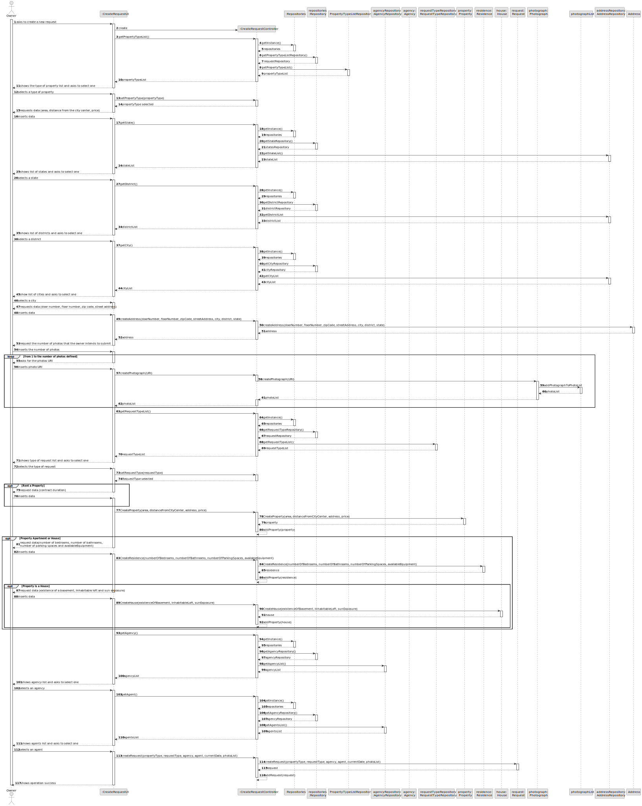
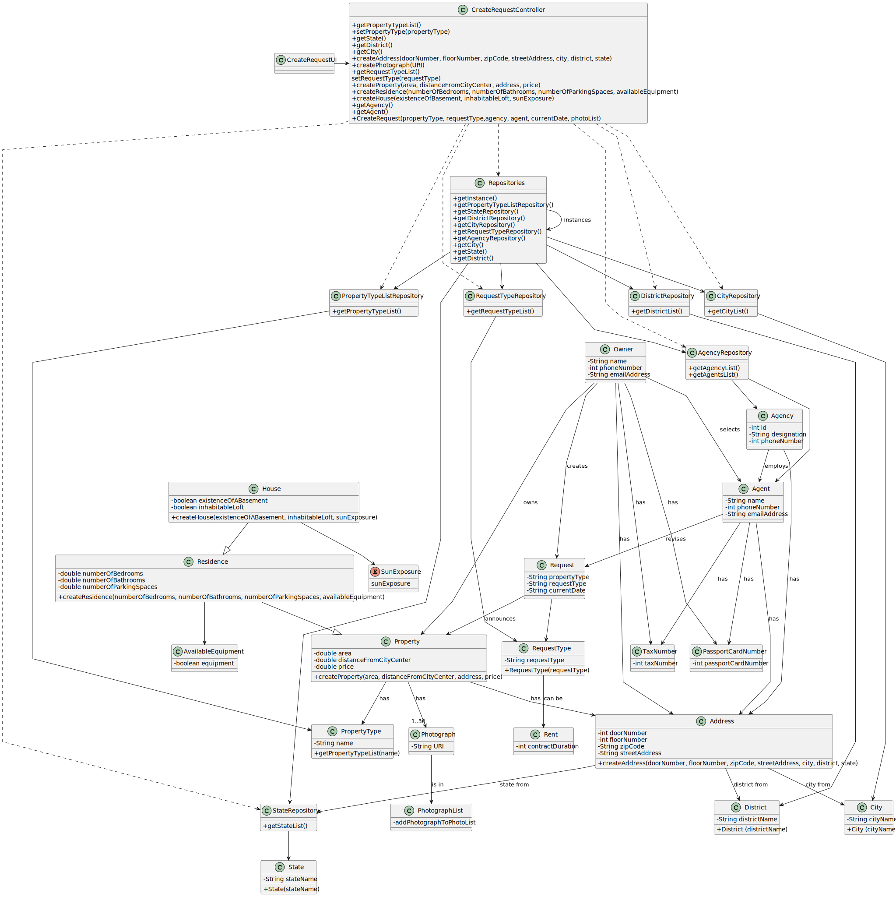

# US 006 - To create a Task 

## 3. Design - User Story Realization 

### 3.1. Rationale

| Interaction ID                                                                                                     | Question: Which class is responsible for...       | Answer                  | Justification (with patterns)                               |
|:-------------------------------------------------------------------------------------------------------------------|:--------------------------------------------------|:------------------------|:------------------------------------------------------------|
| Step 1: asks to create a new request                                                                               | 	... displaying UI to input data?                 | CreateRequestUI         | Pure Fabrication                                            |
| Step 2: shows type of request list and asks to select one  		                                                      | ...knowing the request categories to show?							 | CreateRequestController | Controller                                                  |
| Step 3: selects a type of request  		                                                                              | 	...displaying the type of request?               | Request                 | IE: object created in step 1 has its own data.              |
| Step 4: shows list of property type and asks to select one  		                                                     | 	...displaying the request list?                  | CreateRequestUI         | Pure Fabrication                                            |
| Step 5: selects type of property  		                                                                               | 	... saving the selected category?                |                         | IE: object created in step 1 is classified in one Category. |
| Step 6: requests data(area(m^2), location, price, distanceFromCityCentre)  		                                      | 							                                           |                         |                                                             |              
| Step 7: inserts data		                                                                                             | 	... validating all data (local validation)?      |                         | IE: owns its data.                                          |   		                                                                                                            | 	... saving the created task?                 | Organization    | IE: owns all its tasks.                                     | 
| Step 8: requests the number of photos that the owner intends to submit  		                                         | 	... informing operation success?                 | CreateRequestUI         | IE: is responsible for user interactions.                   | 
| Step 9: inserts the number of photos                                                                               |
| Step 10: asks for the photos URI                                                                                   |
| Step 11: inserts photos URI                                                                                        |
| Step 12: requests data (contract duration)                                                                         |
| Step 13: inserts data                                                                                              |
| Step 14: requests data (number of bedrooms, number of bathrooms, number of parking spaces and available equipment) | ... |
| Step 15: inserts data                                                                                              |
| Step 16: requests data (existence of a basement and/or inhabitable loft and sun exposure)                          |
| Step 17: inserts data                                                                                              |
| Step 18: shows agency list and asks to select one                                                                  |
| Step 19: selects agency                                                                                            | ...|                                               
| Step 20: shows agent list and asks to select one                                                                   | ...display the list of agents?                    | CreateRequestUI         | Pure Fabrication                                            |
| Step 21: selects agent                                                                                             | ...adding the agent to the request?               | Request                 | Information Expert, Request has a list of employess         |
| Step 22: shows all the data related to the request and asks to confirm                                             | ...showing UI with publication details?           | CreateRequestUI         | Pure Fabrication                                            |                                                        
| Step 23: confirms data                                                                                             | ...validating the confirmation?                   |                         ||
| Step 24: shows operation success                                                                                   | ... informing operation success?                  | CreateRequestUI         | Pure Fabrication                                            |

### Systematization ##

According to the taken rationale, the conceptual classes promoted to software classes are: 

 * Property
 * Residence
 * House

Other software classes (i.e. Pure Fabrication) identified: 

 * CreateRequestUI  
 * CreateRequestController

## 3.2. Sequence Diagram (SD)

### Alternative - Full Diagram

## 3.3. Class Diagram (CD)

