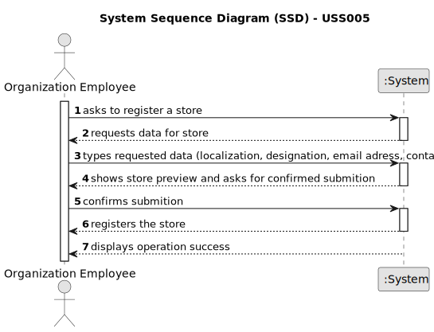

# US 005 - To create a Task 

## 1. Requirements Engineering

### 1.1. User Story Description

As a system administrator, I want to register a store. 

### 1.2. Customer Specifications and Clarifications 

**From the specifications document:**

>   The company's systems administrator will be responsible for registering all employees (specifying
the name, the citizen's card number, the tax number, the address, the email address, the contact
telephone number and the agency to which it is assigned) and branches of the network (specifying
the designation, the location, the email address and the contact telephone number) as well as
preparing the system in order to facilitate the insertion of advertisements and facilitate the use of the
application.

>	Each store in the network has a store manager and the set of stores is managed by a store network
manager. The main functions of a store manager are to monitor and streamline the branch with the
aim of getting to know better the business carried out and to analyse and evaluate the performance
of employees.

**From the client clarifications:**

24th April 

> **Question:**  While a store is being registered, does the system have to provide a list of state, districts and cities?
> 
> **Answer:**  No. Even so, if your team developed US6, you should provide such list. 

23rd March

> **Question:**  How will the designation of new stores be made, is there a pattern perhaps?
>
> **Answer:**  There is no pattern. The System Administrator can introduce any designation/name. The designation/name should have at most forty characters.

> **Question:**  Will the System Administrator be able to choose a location from a list of available locations (defined elsewhere in the application) or will he be able to submit any location he wants?
>
> **Answer:** The System Administrator can submit any location.

> **Question:**  Are the local managers restricted to their initial location or can they be re-registered/reassigned to other locations?
>
> **Answer:**  For now this is not a problem.

> **Question:**  Could you please share how will the designation of new stores be made, is there a pattern perhaps?
> 
> **Answer:**  There is no pattern. The System Administrator can introduce any designation/name. The designation/name should have at most forty characters.

> **Question:**  Will the System Administrator be able to choose a location from a list of available locations (defined elsewhere in the application) or will he be able to submit any location he wants?
> 
> **Answer:**  The System Administrator can submit any location.

> **Question:**  Are the local managers restricted to their initial location or can they be re-registered/reassigned to other locations?
> 
> **Answer:**  For now this is not a problem.

21st March 

> **Question:**  Does a store designation have to be detailed? If so, will the system administrator have to register the name, email, phone number or anything else? Does the location of a store have to be detailed as well? If yes, will the system administrator have to record the address, postcode or something else? To register the store manager, does the system administrator only register the manager's name? If not, will the system administrator have to register the manager as if he were an employee (except the agent he is assigned to)?
> 
> **Answer:**  When registering a store, the System Administrator should introduce the following information: an ID, a designation/name, a location, a local manager, a phone number and an e-mail address. The ID is an integer number.

> **Question:**  When a System Administrator (admin) makes a request to register a new employee or a new network branch (or any other alteration), does the System ask for the admin credentials (login, password)?
> 
> **Answer:**  The System Administrator should be logged in the application.

> **Question:** Can there be more than one admin? 
> 
> **Answer:** No. 
 

### 1.3. Acceptance Criteria

* **AC1:** Declaring the obligatory data to register a store.
* **AC2:** The designation/name should be at most forty characters.
* **AC3:** The phone number must have 10 digits. The first 3 digits must correspond to the "area code", the next 3 correspond to the geographical area and the last four can be random.

### 1.4. Found out Dependencies

* There is a dependency to "US003: As a system administrator, I want to register a new employee" since the system administrator that in US005 will be responsible for registering a store will also be responsible for registering employees.
* There is a dependency linked to "US006: As a system administrator, I want to specify states, districts and cities in the system" due to the fact that US005 demands a location with state, district and city that are specified and implement on US6.

### 1.5 Input and Output Data

**Input Data:**

* Typed data:
	* an ID, 
	* a designation/name,
    * a location,
	* a local manager, 
	* a phone number, 
	* an e-mail address.
	
* Selected data:
	* Classifying task category 

**Output Data:**

* (In)Success of the operation

### 1.6. System Sequence Diagram (SSD)

**Other alternatives might exist.**

#### Alternative One

### 1.7 Other Relevant Remarks

*  There are no other relevant remarks. 