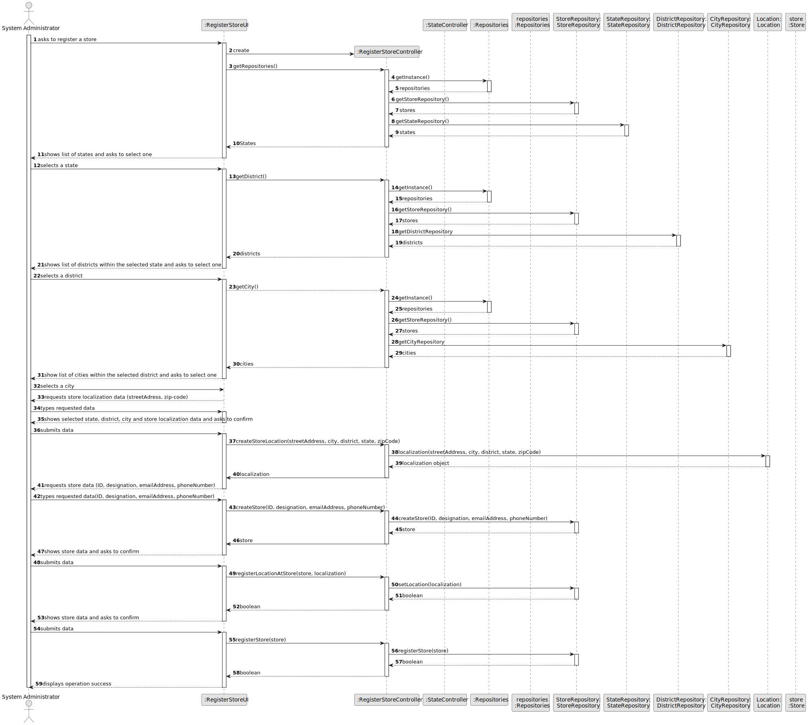
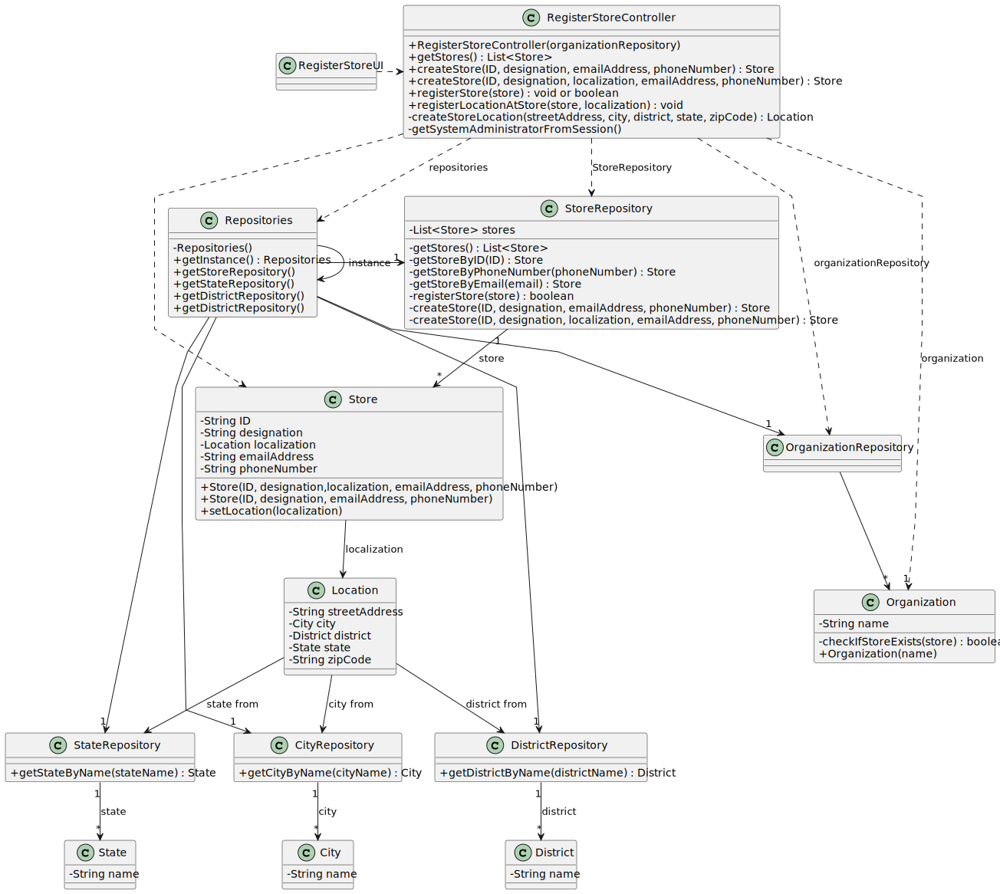

# US 005 - To create a Task 

## 3. Design - User Story Realization 

### 3.1. Rationale

**SSD - Alternative 1 is adopted.**

| Interaction ID | Question: Which class is responsible for...  | Answer                  | Justification (with patterns)                                                                                |
|:---------------|:---------------------------------------------|:------------------------|:-------------------------------------------------------------------------------------------------------------|
| Step 1  		     | 	... interacting with the actor?             | RegisterStoreUI         | Pure Fabrication: there is no reason to assign this responsibility to any existing class in the Domain Model |
| 			  		        | 	... coordinating the US?                    | RegisterStoreController | Controller                                                                                                   |
| 			  		        | 	... instantiating a new Task?               | Organization            | Creator (Rule 1): in the DM Organization has a Task                                                          |
| 			  		        | 							                                      | Organization            | IE: knows/has its own Employees                                                                              |
| 			  		        | 							                                      | Employee                | IE: knows its own data (e.g. email)                                                                          |
| Step 2  		     | 							                                      |                         |                                                                                                              |
| Step 3  		     | 	...saving the inputted data?                | Store                   | IE: Store has it's own data (ID, designation, location, email address, phone number)                         |
| Step 4  		     | 	...saving the location?                     | Location                | IE: The location saves everything about the street address, city, district, state and zip Code               |
| Step 5  		     | 	...registering the store location           | RegisterStoreController | IE: Regists and controls the stores information                                                              |
| 		             | 	...showing the stores                       | StoreRepository         | Repository: Shows and knows all the stores                                                                   | 
| Step 6  		     | 							                                      |                         |                                                                                                              |              
| Step 7  		     | 	... validating all data (local validation)? | Store                   | IE: Store owns its data                                                                                      | 
| 			  		        | 	... validating location?                    | StoreRepository         | Repository: Knows all stores and their locations                                                             | 
| Step 8  		     | 	... informing operation success?            | RegisterStoreUI         | UI: responsible for the interactions with the user                                                           | 

### Systematization ##

According to the taken rationale, the conceptual classes promoted to software classes are: 

 * Store
 * State
 * Address

Other software classes (i.e. Pure Fabrication) identified: 

 * RegisterStoreUI  
 * RegisterStoreController

## 3.2. Sequence Diagram (SD)

### Alternative 1 - Full Diagram

This diagram shows the full sequence of interactions between the classes involved in the realization of this user story.

## 3.3. Class Diagram (CD)

