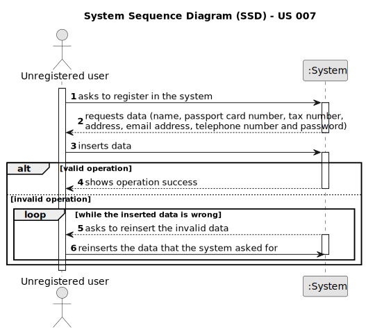

# US 007 - To register a user

## 1. Requirements Engineering

### 1.1. User Story Description

As an unregistered user, I want to register in the system to buy, sell or rent properties.

### 1.2. Customer Specifications and Clarifications

**From the specifications document:**

Roles:
* Owner;
* Client (rent or buy).

**From the client clarifications:**

### 1.3. Acceptance Criteria

**AC1: All required fields must be filled in.**

**AC2: Registered account must not exist previously.**

**AC3: When registering an account that already exists, the system must reject such operation.**

### 1.4. Found out Dependencies

* There is no dependency to any other US.

### 1.5 Input and Output Data

**Input Data:**

* Typed data:
      * the name
      * the passport number
      * the tax number
      * the address
      * the email address
      * the telephone

* Selected data:
     * role type

**Output Data:**

* Role options (Owner or client)

* (In)Success of the operation

### 1.6. System Sequence Diagram (SSD)

### 1.7 Other Relevant Remarks

* There are no other relevant remarks.