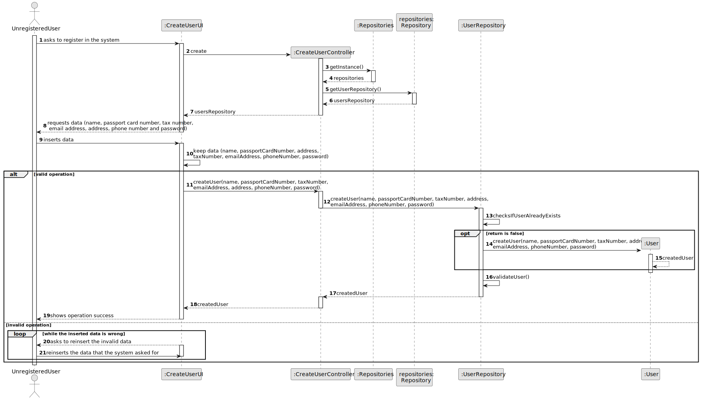
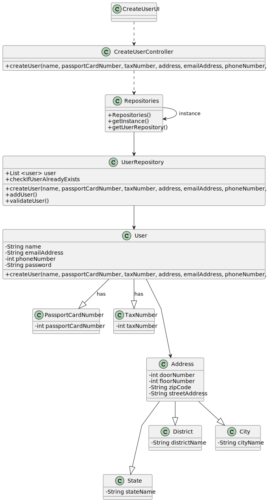

# US 007 - Registration in the system 

## 3. Design - User Story Realization 

### 3.1. Rationale

| Interaction ID | Question: Which class is responsible for...        | Answer               | Justification (with patterns)                                                                                 |
|:---------------|:---------------------------------------------------|:---------------------|:--------------------------------------------------------------------------------------------------------------|
| Step 1  		     | 	... interacting with the actor?                   | CreateUserUI         | Pure Fabrication: there is no reason to assign this responsibility to any existing class in the Domain Model. |
| 			  		        | 	... coordinating the US?                          | CreateUserController | Controller                                                                                                    |
| Step 2  		     | 							                                            |                      |                                                                                                               |
| Step 3  		     | 	...requests and keeps data?                       | CreateUserUI         | IE: Keeps and owns the data.                                                                                  |
| Step 4  		     | 	...creates and checks if the user already exists? | UserRepository       | IE: UserRepository owns the data from every user that creates an account                                      | 
| Step 5 		      | 	... validating all data ?                         | UserRepository       | IE: The UserRepository now owns the data.                                                                     |
| Step 6		       | 	... informing operation success/?                 | CreateUserUI         | IE: is responsible for user creations.                                                                        | 

### Systematization ##

According to the taken rationale, the conceptual classes promoted to software classes are: 

 * User

Other software classes (i.e. Pure Fabrication) identified: 

 * CreateUserUI  
 * CreateUserController

## 3.2. Sequence Diagram (SD)

## 3.3. Class Diagram (CD)

