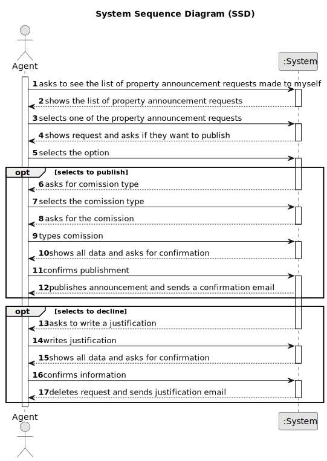

# US 008 - See and post announcement request

## 1. Requirements Engineering

### 1.1. User Story Description

As an agent, I intend to see the list of property announcement requests made to myself, so that I can post the announcement.

### 1.2. Customer Specifications and Clarifications 

**From the specifications document:**

>

**From the client clarifications:**

> **Question:** When displaying the property announcement requests in the system to the agent besides them being ordered from most recent to oldest is there a need to display the specific day where the requests were published?
>  
> **Answer:** The list of property announcement requests should be sorted by the date they were created, with the most recent requests appearing first. The system should show the date when the property announcement requests was made.

> **Question:** When displaying the property announcement requests in the system to the agent besides them being ordered from most recent to oldest is there a need to display the specific day where the requests were published?
>
> **Answer:** The list of property announcement requests should be sorted by the date they were created, with the most recent requests appearing first. The system should show the date when the property announcement requests was made.

> **Question:** Can the agent select multiple requests at the same time?
>
> **Answer:** No. The agent can only post one announcement at a time.

> **Question:** Regarding US008, can the agent decline an announcement request?
>
> **Answer:** Yes. The agent must include a message justifying the rejection.

> **Question:** In this US8, will it be necessary to show search criteria? If so, which ones?
>
> **Answer:** There is no search criteria.

> **Question:** Is the owner responsible to assigning the property to an agent or there are other ways to do that?
>
> **Answer:** In US8 we get "As an agent, I intend to see the list of property announcement requests made to myself, so that I can post the announcement". In this US the agent is the actor.

### 1.3. Acceptance Criteria

* **AC1:** The list of property announcement requests should be sorted by the date they were created, with the most recent requests appearing first.
* **AC2:** An announcement is posted when a request is accepted. The list of requests should be refreshed, and that request should not be shown again.

### 1.4. Found out Dependencies

* US4 - US8 needs the announcement to exist

### 1.5 Input and Output Data

**Input Data:**

* Typed data:
	
* Selected data:
	* Announcement to see
    * Publish anouncement or not

* Other data:

**Output Data:**

* Announcement requests
* Specific announcement information
* Success message

### 1.6. System Sequence Diagram (SSD)

### 1.7 Other Relevant Remarks