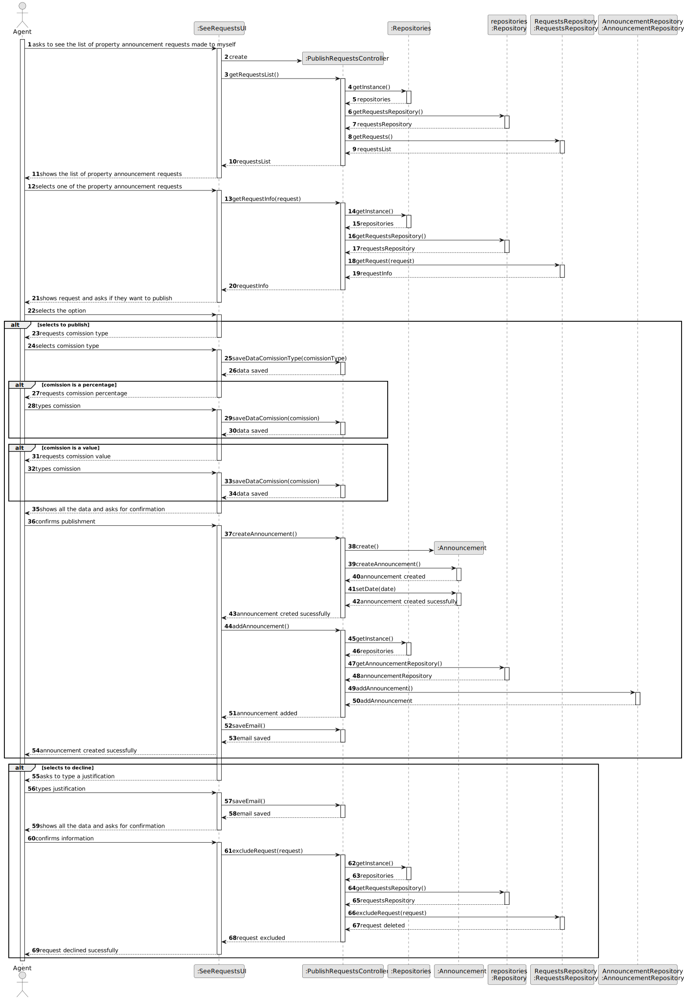

# US 002 - Publish a sale announcement

## 3. Design - User Story Realization 

### 3.1. Rationale

**SSD**

| Interaction ID                                           | Question: Which class is responsible for... | Answer                         | Justification (with patterns)             |
|:---------------------------------------------------------|:--------------------------------------------|:-------------------------------|:------------------------------------------|
| Step 1: Asks to register a new announcement              | ... interacting with the user?              | RegisterAnnouncementUI         | Pure fabrication                          |
|                                                          | ... coordinating with the US?               | RegisterAnnouncementController | Controller                                |
|                                                          | ... initiating a new announcement?          | Repositories                   | Creator                                   |
|                                                          | ... get property type repository?           | Repository                     | Information Expert, Pure Fabrication      |
|                                                          | ... get property type list?                 | PropertyTypeRepository         | Information Expert, Pure Fabrication      |
| Step 2: Shows property type list and asks to sleect one  | ... displaying the list?                    | RegisterAnnouncementUI         | IE : is responsible with user interaction |
| Step 3: Selects a property type                          | ... set the answer?                         | RegisterAnnouncementController | IE : is responsible with user interaction |
| Step 4: Requests data to verify if the owner is registed | ... displaying the request?                 | RegisterAnnouncementUI         | IE : is responsible with user interaction |
|                                                          | ... set the answer?                         | RegisterAnnouncementController | IE : is responsible with user interaction |
|                                                          | ... verify is user is registed?             | Repositories                   | Information Expert, Pure Fabrication      |
|                                                          | ... get registed users repository?          | Repository                     | Information Expert, Pure Fabrication      |
|                                                          | ... get registed users list?                | RegistedUserRepository         | Information Expert, Pure Fabrication      |
|                                                          | ... verify if user is registed?             | RegisterAnnouncementController | IE : is responsible with user interaction | 
| Step 5: Types the requested data                         | ... set the answer?                         | RegisterAnnouncementController | IE : is responsible with user interaction |
| Step 6: Requests property data                           | ... displaying the request?                 | RegisterAnnouncementUI         | IE : is responsible with user interaction |
| Step 7: Types the requested data                         | ... set the answer?                         | RegisterAnnouncementController | IE : is responsible with user interaction |
| Step 8: Requests residency data                          | ... displaying the request?                 | RegisterAnnouncementUI         | IE : is responsible with user interaction |
| Step 9: Types the requested data                         | ... set the answer?                         | RegisterAnnouncementController | IE : is responsible with user interaction |
| Step 10: Requests appartment data                        | ... displaying the request?                 | RegisterAnnouncementUI         | IE : is responsible with user interaction |
| Step 11: Types the requested data                        | ... set the answer?                         | RegisterAnnouncementController | IE : is responsible with user interaction |
| Step 12: Requests comission type                         | ... displaying the request?                 | RegisterAnnouncementUI         | IE : is responsible with user interaction |
| Step 13: Selects comission type                          | ... set the answer?                         | RegisterAnnouncementController | IE : is responsible with user interaction |
| Step 14: Requests comission                              | ... displaying the request?                 | RegisterAnnouncementUI         | IE : is responsible with user interaction |
| Step 15: Types comission                                 | ... set the answer?                         | RegisterAnnouncementController | IE : is responsible with user interaction |
| Step 16: Presents all the data inserted                  | ... displaying the data?                    | RegisterAnnouncementUI         | IE : is responsible with user interaction |
| Step 17: Confirms inserted data                          | ... set the answer?                         | RegisterAnnouncementController | IE : is responsible with user interaction |
|                                                          | ... iniciate announcement?                  | RegisterAnnouncementController | IE : is responsible with user interaction |
|                                                          | ... create announcement and set date?       | Announcement                   | Creator                                   |
| Step 18: Announcement created sucessfully                | ... display sucess?                         | RegisterAnnouncementUI         | IE : is responsible with user interaction |

### Systematization ##

According to the taken rationale, the conceptual classes promoted to software classes are: 

 * Announcement
 * Repository
 * PropertyTypeRepository
 * RegistedUserRepository

Other software classes (i.e. Pure Fabrication) identified: 

 * RegisterAnnouncementUI  
 * RegisterAnnouncementController

## 3.2. Sequence Diagram (SD)

This diagram shows the full sequence of interactions between the classes involved in the realization of this user story.

## 3.3. Class Diagram (CD)

