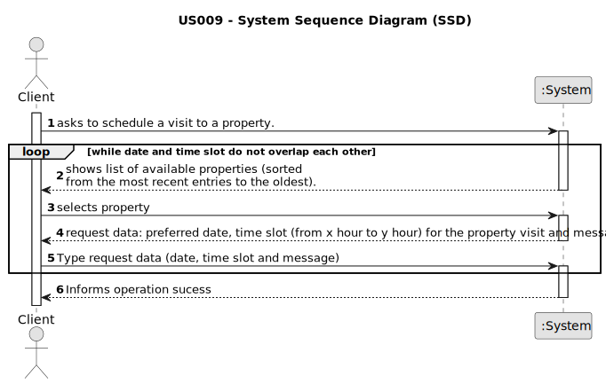

# US 001

## 1. Requirements Engineering

### 1.1. User Story Description

As a client, I want to leave a message to the agent to schedule a visit to a property of my interest.

### 1.2. Customer Specifications and Clarifications 

**From the specifications document:**

**From the client clarifications:**

> **Question:** The client can make multiple schedules in a single message?
>  
> **Answer:**  Every time the client makes use of this feature of the system, the client can specify multiple date/time slots.

> **Question:** On US9 AC1 it is says: "AC1. A list of available properties must be shown, sorted from the most recent entries to the oldest." Does this mean that we can only have the option to make contact in this type of sort?
> 
> **Answer:** No. AC1 is the default sorting method.

> **Question:** When we list in another way, should not be possible to have the option to schedule a visit?
>
> **Answer:** After sorting the properties, the cliente can still schedule a visit.

> **Question:**  Assuming that this is done so the client can see the available properties in order to select one and given that in a previous question you've stated that the required information for the message should be typed then, for this US, is the only selected data the property that the client wishes to visit?
>
> **Answer:** System behavior must be consistent. For instance, the filters to be applied when the client is viewing a list of properties should be similar to the filters used in US1.

> **Question:**  In AC2, when the suggestion of date and time is sent, is there a standard duration for the visit or is it mandatory to fill in a start time and an end time for the visit?
>
> **Answer:** There is no standard duration to schedule a visit. The client should define his availability specifying the start time and the end time for the visit.

> **Question:** In AC2, can any time be used or are we limited to certain hours?
>
> **Answer:** Any time can be used.

> **Question:** Also in AC2, should we use the 12am/pm or 24-hour time format?
>
> **Answer:** Please use 24-hour time format.

> **Question:** In the message what is the characteristic to identify the property to visit? Can we use the location?
>
> **Answer:** The message should be associated with a property. Please check AC1. The client should select a property that he wants to visit before making the visit request.

> **Question:** When sending the message, is the visit immediately scheduled after being validated by the system, or is it necessary for the agent to approve it?
>
> **Answer:** No, the client is only making a visit request.

> **Question:** Can the customer visit the same property more than once?
>
> **Answer:** A client may post multiple visit requests, but only if those do not overlap each other. In this US the client is only scheduling a visit to a property. In the beginning of Sprint D we will introduce more USs.

> **Question:** When the user story says that the agent verifies the property availability, its for the program to do the verification or there must be a real interaction between the two actors? Quote from the document: "The agent receives the request, checks the availability and sends the response. If the customer accepts the order, it is automatically scheduled in the system."
>
> **Answer:**  This quote is not from US9...Please be careful and rigorous!

> **Question:** Can the client make multiple schedules in a single message for different properties, or can they only have 1 property per message with multiple schedules?
>
> **Answer:** The client can only schedule a visit to one property at a time. Each time the client schedules a visit, the client should specify, for each day, one or multiple time slots. The time slots should not overlap. If the client wants to visit more properties, the client should use/run again the visit scheduling feature available in the system.

> **Question:** Should the scheduling be limited to a time interval ? e.g 08:00 - 20:00 ?
>
> **Answer:** No. I just answered this question. Please check previous questions before making a repeated question.

> **Question:** When writing the information to schedule a meeting with the agent, the preferred date and the time slot of the visit should be checked. The client can choose any day of the year? And any time of the day?
>
> **Answer:** Any date and time can be specified. We are always available to our customers!

> **Question:**
>
> **Answer:**

> **Question:**
>
> **Answer:**

> **Question:**
>
> **Answer:**

> **Question:**
>
> **Answer:**

### 1.3. Acceptance Criteria

* *AC1:* A list of available properties must be shown, sorted from the most recent entries to the oldest.
* *AC2:* The message must also include the client's name, phone number, preferred date and time slot (from x hour to y hour) for the property visit.
* *AC3:* A client may post multiple visit requests, but only if those do not overlap each other.
* *AC4:* The client must receive a success message when the request is valid and registered in the system.
* *AC5:* Time format must be 24-hour format.
* *AC6:* 
* *AC7:*
* *AC8:*
* *AC9:*
* *AC10:*
* *AC11:*
* *AC12:*
* *AC13:*

### 1.4. Found out Dependencies

* In US007 you to register a client

### 1.5 Input and Output Data

**Input Data:**

* Typed Data:
  
  * Preferred date for the visit
  * Time slot of the visit

* Selected data:
  * chosen property for the visit

**Output Data:**

* List of properties sorted from the most recent entries to the oldest.
* (In)Success of the operation
* Show message: "Want to try more?"

### 1.6. System Sequence Diagram (SSD)

### 1.7 Other Relevant Remarks