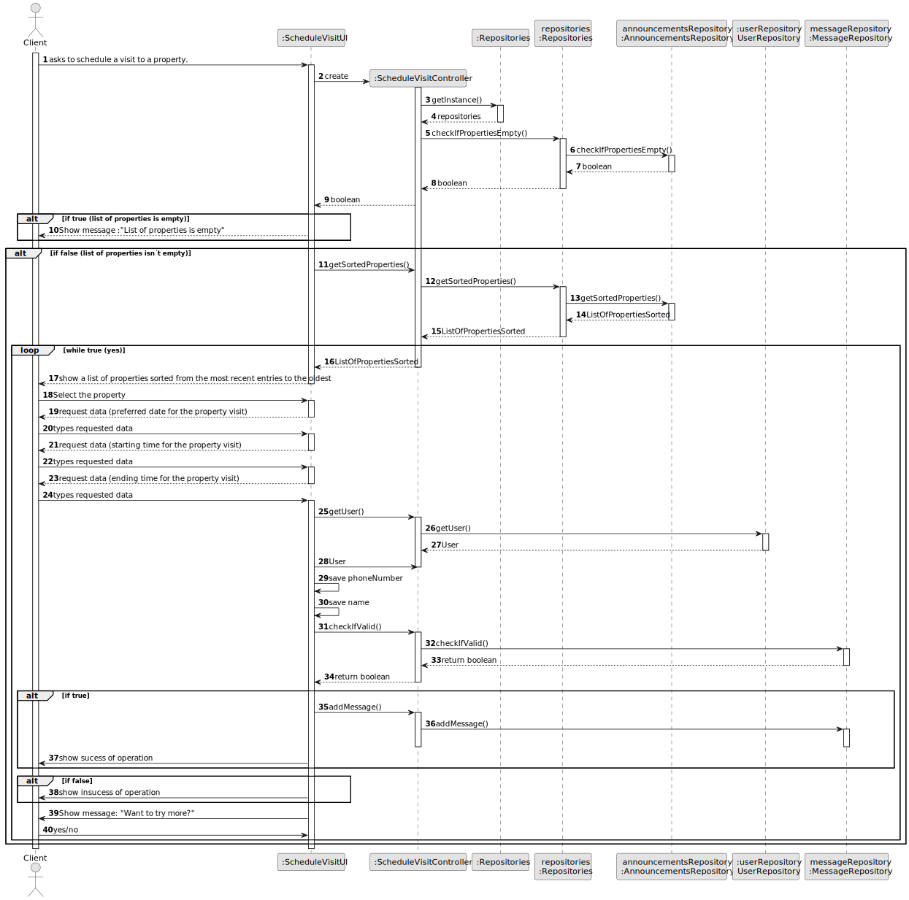
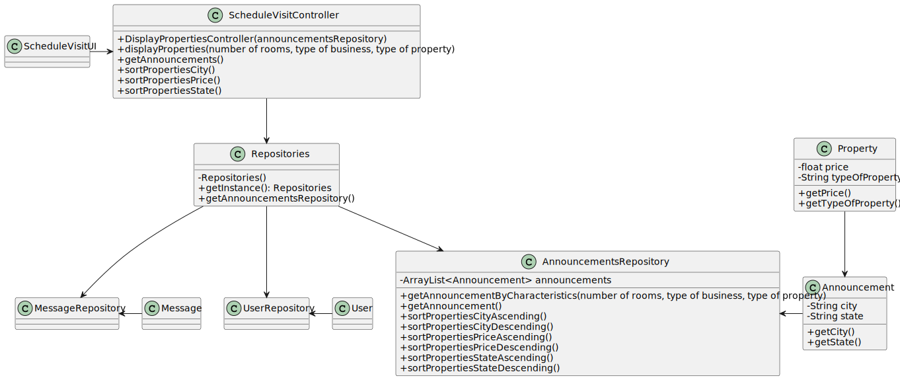

# US 009 - Leave a message to the agent to schedule a visit to a property.

## 3. Design - User Story Realization 

### 3.1. Rationale

**SSD - Alternative 1 is adopted.**

| Interaction ID | Question: Which class is responsible for...               | Answer                  | Justification (with patterns)                                                                                 |
|:---------------|:----------------------------------------------------------|:------------------------|:--------------------------------------------------------------------------------------------------------------|
| Step 1  		     | 	... interacting with the actor?                          | ScheduleVisitUI         | Pure Fabrication: there is no reason to assign this responsibility to any existing class in the Domain Model. |
| 			  		        | 	... coordinating the US?                                 | ScheduleVisitController | Controller                                                                                                    |
| 			  		        | 	... creating a new message?                              | MessageRepository       | Creator (Rule 1): in the DM one Announcement has just one Property.                                                         |
| Step 2  		     | 	...knowing the specific characteristics to select?						 |                         |                                                                                                               |
| Step 3  		     | 	...saving the inputted data?                             | Task                    | IE: object created in step 1 has its own data.                                                                |
| Step 4  		     | 	...knowing the task categories to show?                  | System                  | IE: Task Categories are defined by the Administrators.                                                        |
| 

### Systematization ##

According to the taken rationale, the conceptual classes promoted to software classes are: 

 * Announcement
 * Message
 * User

Other software classes (i.e. Pure Fabrication) identified: 

 * ScheduleVisitUI
 * ScheduleVisitController
 * MessageRepository
 * UserRepository
 * AnnoucementsRepository

## 3.2. Sequence Diagram (SD)

### Alternative 1 - Full Diagram

This diagram shows the full sequence of interactions between the classes involved in the realization of this user story.

## 3.3. Class Diagram (CD)

