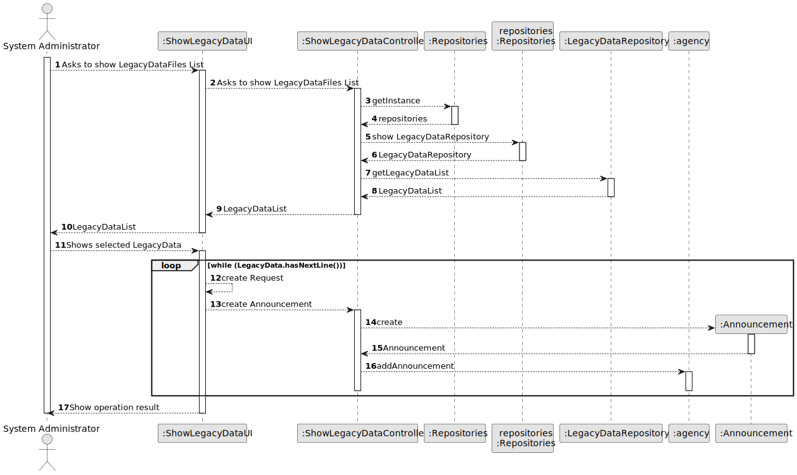
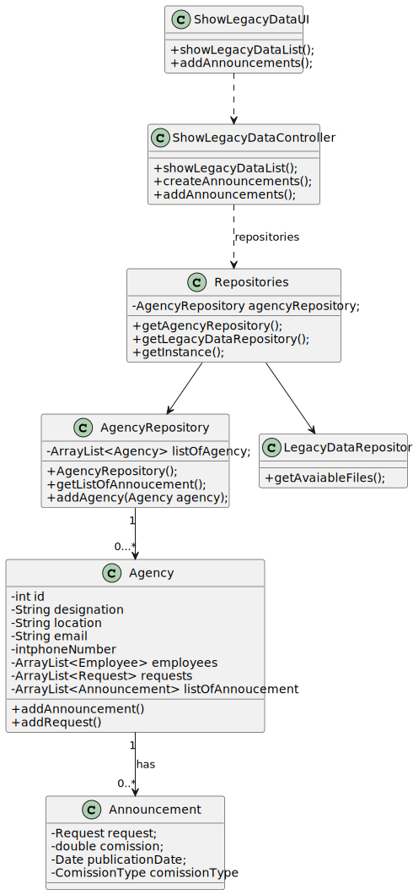

# US 012 - System Administrator imports information from a legacy system 

## 3. Design - User Story Realization 

### 3.1. Rationale

**SSD - Alternative 1 is adopted.**

| Interaction ID | Question: Which class is responsible for...            | Answer                         | Justification (with patterns) |
|:---------------|:-------------------------------------------------------|:-------------------------------|:------------------------------|
| Step 1  		     | 	 ...interacting with the actor (ask data filter)?     | ShowLegacyDataUI               | Pure Fabrication              |
| 			  		        | 	... coordinating the US?                              | ShowLegacyDataController       | Controller                    |                                                                                                    | Creator (Rule 1): in the DM Organization has a Task.                                                         |                                                                                                                      |
|                | ... has all the repositorys                            | Repositories                   | Informant Expert              |
| 		 Step 2             | ... show the list requested by the user?					          | ShowLegacyDataUI               | Pure Fabrication              |
| 		             | ... get the list of Files?					                        | ShowLegacyDataController       | Repositories usage            |
| 		      | ... show list of announcements or a empty list?					   | ShowAnnouncementListUI         | Controller                    |
| Step 3  		     | 	 ...saving the temporary data                         | ShowLegacyDataUI               | Pure Fabrication              |
| Step 4  		     | ...interacting with the actor (ask data filter again)? | ShowLegacyDataUI               | Pure Fabrication              |
| 		             | ... create the announcements?					                     | ShowLegacyDataController       | Controller                    |
| 		             | ... saves the list of announcements?					              | agency                         | Repositories usage            |

### Systematization ##

According to the taken rationale, the conceptual classes promoted to software classes are: 

 * Announcement
 * Agency

Other software classes (i.e. Pure Fabrication) identified: 

* ShowLegacyDataUI
* ShowLegacyDataController

## 3.2. Sequence Diagram (SD)

### Alternative 1 - Full Diagram

This diagram shows the full sequence of interactions between the classes involved in the realization of this user story.

## 3.3. Class Diagram (CD)

