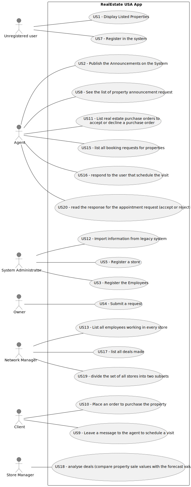

# Use Case Diagram (UCD)

# Use Cases / User Stories

| UC/US  | Description                                                                                                            |                   
|:-------|:-----------------------------------------------------------------------------------------------------------------------|
| US 001 | [Display listed properties](../../us001/Readme.md)                                                                     |
| US 002 | [Publish any sale announcement](../../us002/Readme.md)                                                                 |
| US 003 | [Register a new employee](../../us003/Readme.md)                                                                       |
| US 004 | [Request a list of properties for sale or lease](../../us004/Readme.md)                                                |
| US 005 | [Register a store](../../us005/Readme.md)                                                                              |       
| US 007 | [Register in the system to buy, sell or rent properties](../../us007/Readme.md)                                        |                 
| US 008 | [See the list of property announcement request](../../us008/Readme.md)                                                 |
| US 009 | [Leave a message to the agent to schedule a visit](../../us009/Readme.md)                                              |
| US 010 | [Place an order to purchase the property](../../us010/Readme.md)                                                       |
| US 011 | [List real estate purchase orders to accept or decline a purchase order](../../us011/Readme.md)                        |
| US 012 | [Import information from legacy system](../../us012/Readme.md)                                                         |
| US 013 | [List all employees working in every store](../../us013/Readme.md)                                                     |
| US 014 | [Read the response for the appointment requests, to accept or reject it](../../us014/Readme.md)                        |
| US 015 | [List all booking requests for properties managed byme](../../us015/Readme.md)                                         |
| US 016 | [When viewing a booking request, I want to respond to the user that scheduled the visit](../../us016/Readme.md)        |
| US 017 | [As a network manager, I want to list all deals made.](../../us017/Readme.md)                                          |
| US 018 | [As a store manager, I intend to analyse the deals](../../us018/Readme.md)                                             |
| US 019 | [As a network manager, I want to divide the set of all stores into two subsets](../../us019/Readme.md)                 |
| US 020 | [As a client, I want to read the response for the appointment request, to accept or reject it.](../../us020/Readme.md) |

