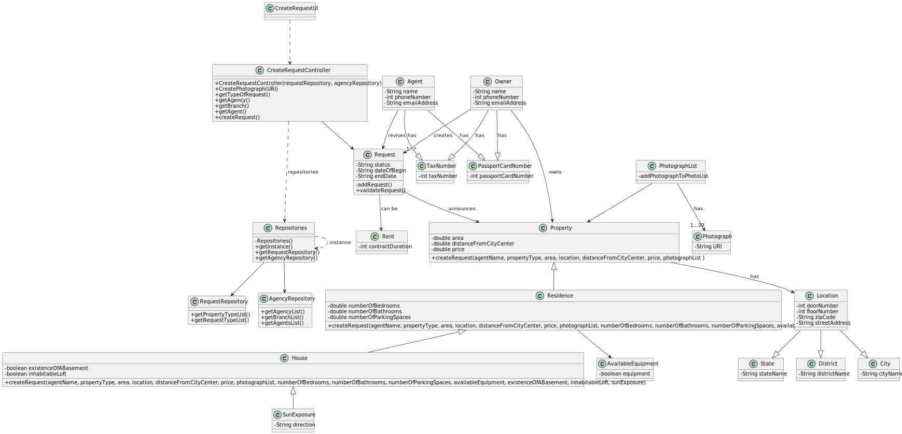

# US 004 - To create a Request

## 3. Design - User Story Realization

### 3.1. Rationale

| Interaction ID                                                                                                     | Question: Which class is responsible for... | Answer                  | Justification (with patterns)                                                                                 |
|:-------------------------------------------------------------------------------------------------------------------|:--------------------------------------------|:------------------------|:--------------------------------------------------------------------------------------------------------------|
| Step 1: asks to create a new request                                                                               | ...interacting with the actor?              | CreateRequestUI         | Pure Fabrication: there is no reason to assign this responsibility to any existing class in the Domain Model. |
|                                                                                                                    | ...coordinating the US?                     | CreateRequestController | Controller                                                                                                    |
|                                                                                                                    | ...instantiating a new Request?             | Owner                   | Creator (Rule 1): in the DM Owner has a Request                                                               | 
|                                                                                                                    | ...assigning the request?                   | Agency                  | IE: knows/has its own Employees                                                                               |
|                                                                                                                    | ...handling the request?                    | Agent                   | IE: knows its own data                                                                                        |
| Step 2: shows the type of property list and asks to select one                                                     | ...knowing the type of properties to show?  | System                  | IE: type of properties are defined by the Administrator                                                       |
| Step 3: selects a type of property 		                                                                              | ...saving the selected data?                | CreateRequestUI         | Pure Fabrication                                                                                              |
| Step 4: requests data (area(m^2), location, distanceFromCityCentre, price)		                                       | ...knowing the request categories to show?  | System                  | IE: Information is defined by the Administrator                                                               |
| Step 5: inserts data  		                                                                                           | ... saving the selected category?           | CreateRequestUI         | Pure Fabrication                                                                                              |
| Step 6: requests the number of photos that the owner intends to submit  		                                         | ...knowing the information to ask?						    | System                  | IE: Information is defined by Administrator                                                                   |              
| Step 7: inserts the number of photos	                                                                              | ... saving the inputted data?               | CreateRequestUI         | Pure Fabrication                                                                                              |   		                                                                     
| Step 10: asks for the photos URI                                                                                   | ...knowing what to ask?                     | System                  | IE: Information is defined by the Administrator                                                               |
| Step 11: inserts photos URI                                                                                        | ...saving the inputted data?                | Photograph              | IE: owns its data                                                                                             |
| Step 12: shows type of request list and asks to select one                                                         | ...knowing the types of request?            | System                  | IE: Information is defined by the Administrator                                                               |
| Step 13: selects the type of request                                                                               | ...saving the inputted data?                | PhotographList          | 
| Step 14: requests data (contract duration)                                                                         | ...knowing the information to ask?          | System                  | IE: Information is defined by the Administrator                                                               |
| Step 15: inserts data                                                                                              | ...saving inputted data?                    | CreateRequestUI         | Pure Fabrication                                                                                              |
| Step 16: requests data (number of bedrooms, number of bathrooms, number of parking spaces and available equipment) | ...knowing the information to ask?          | System                  | IE: Information required to list a residence is defined by the Administrator                                  |
| Step 17: inserts data                                                                                              | ...saving the inputted data?                | CreateRequestUI         | Pure Fabrication                                                                                              |
| Step 18: requests data (existence of a basement, inhabitable loft and sun exposure)                                | ...knowing the information to ask?          | System                  | IE: information required to list a house is defined by the Administrator                                      |
| Step 19: inserts data                                                                                              | ...saving the inputted data?                | CreateRequestUI         | Pure Fabrication                                                                                              |                                                                                                                                      
| Step 20: shows branch list and asks to select one                                                                  | ...display the list of branches?            | CreateRequestUI         | Pure Fabrication                                                                                              |
| Step 21: selects a branch                                                                                          | ...adding the branch to the request?        | Request                 | Information Expert, the system has a list of branches defined by the Administrator                            |
| Step 22: shows agents list and asks to select one                                                                  | ...display the list of agents?              | CreateRequestUI         | Pure Fabrication                                                                                              |
| Step 23: selects an agent                                                                                          | ...adding the agent to the request?         | Request                 | Information Expert, Request has a list of agents                                                              |
| Step 24: shows operation success                                                                                   | ... informing operation success?            | CreateRequestUI         | PureFabrication                                                                                               |

### Systematization ##

According to the taken rationale, the conceptual classes promoted to software classes are:

* Property
* Residence
* House

Other software classes (i.e. Pure Fabrication) identified:

* CreateRequestUI
* CreateRequestController

## 3.2. Sequence Diagram (SD)

### Alternative - Full Diagram

## 3.3. Class Diagram (CD)

