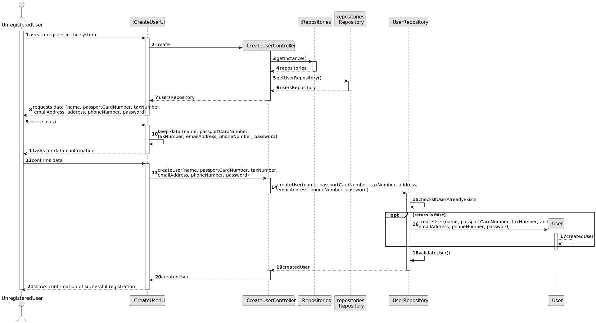
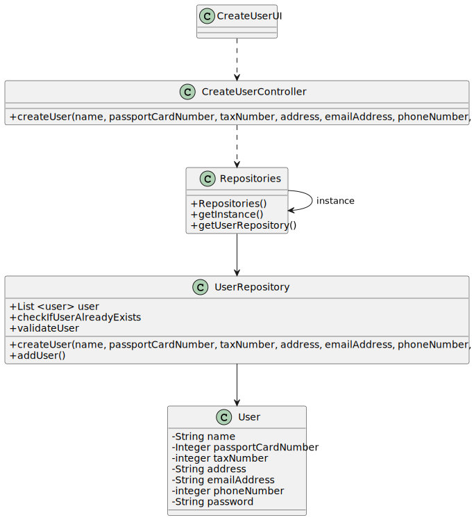

# US 007 - To regist in the system 

## 3. Design - User Story Realization 

### 3.1. Rationale

**SSD - Alternative 1 is adopted.**

| Interaction ID | Question: Which class is responsible for...       | Answer               | Justification (with patterns)                                                                                 |
|:---------------|:--------------------------------------------------|:---------------------|:--------------------------------------------------------------------------------------------------------------|
| Step 1  		     | 	... interacting with the actor?                  | CreateUserUI         | Pure Fabrication: there is no reason to assign this responsibility to any existing class in the Domain Model. |
| 			  		        | 	... coordinating the US?                         | CreateUserController | Controller                                                                                                    |
| 			  		        | 	... instantiating a new Task?                    | Organization         | Creator (Rule 1): in the DM Organization has a Task.                                                          |
| 			  		        | ... knowing the user using the system?            | UserSession          | IE: cf. A&A component documentation.                                                                          |
| 			  		        | 							                                           | Organization         | IE: knows/has its own Employees                                                                               |
| 			  		        | 							                                           | Employee             | IE: knows its own data (e.g. email)                                                                           |
| Step 2  		     | 							                                           |                      |                                                                                                               |
| Step 3  		     | 	...requests and keeps dta?                       | CreaterUserUI        | IE: Keeps and owns the data.                                                                                  |
| Step 4  		     | 	...creates and cheks if the user already exists? | UserRepository       | IE: UserRepository owns the data from every user that creates an account                                      |
| Step 5  		     | 	... saving the selected category?                | Task                 | IE: object created in step 1 is classified in one Category.                                                   |
| Step 6  		     | 							                                           |                      |                                                                                                               |              
| Step 7  		     | 	... validating all data ?                        | UserRepository       | IE: The UserRepository now owns the data.                                                                     | 
| 			  		        | 	... validating all data (global validation)?     | Organization         | IE: knows all its tasks.                                                                                      | 
| 			  		        | 	... saving the created task?                     | Organization         | IE: owns all its tasks.                                                                                       | 
| Step 7		       | 	... informing operation success?                 | CreateUserUI         | IE: is responsible for user creations.                                                                        | 

### Systematization ##

According to the taken rationale, the conceptual classes promoted to software classes are: 

 * User

Other software classes (i.e. Pure Fabrication) identified: 

 * CreateUserUI  
 * CreateUserController

## 3.2. Sequence Diagram (SD)

## 3.3. Class Diagram (CD)

