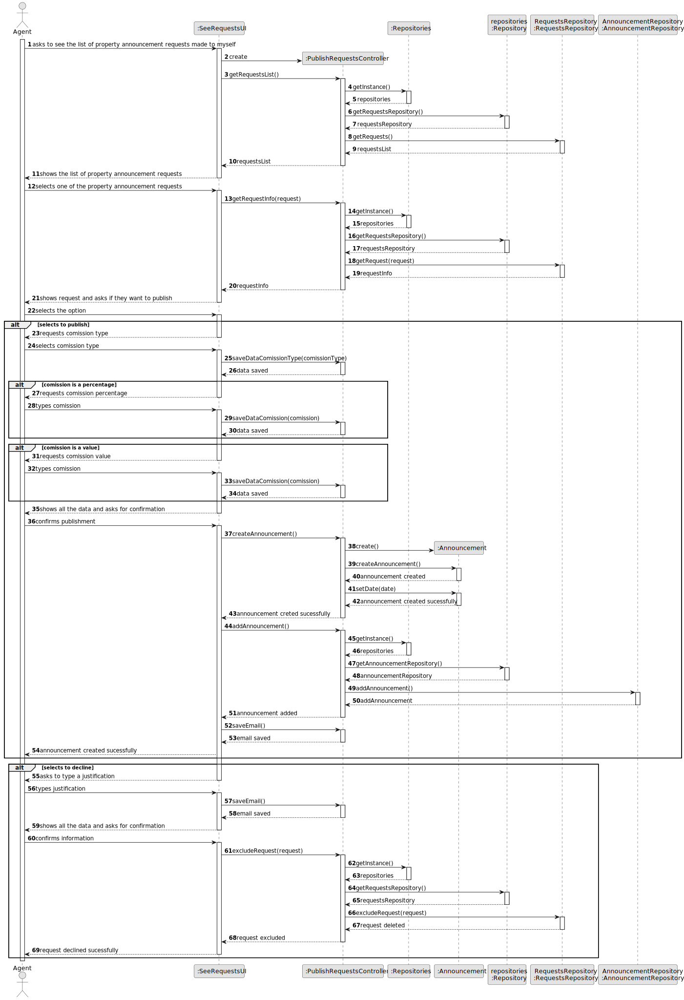
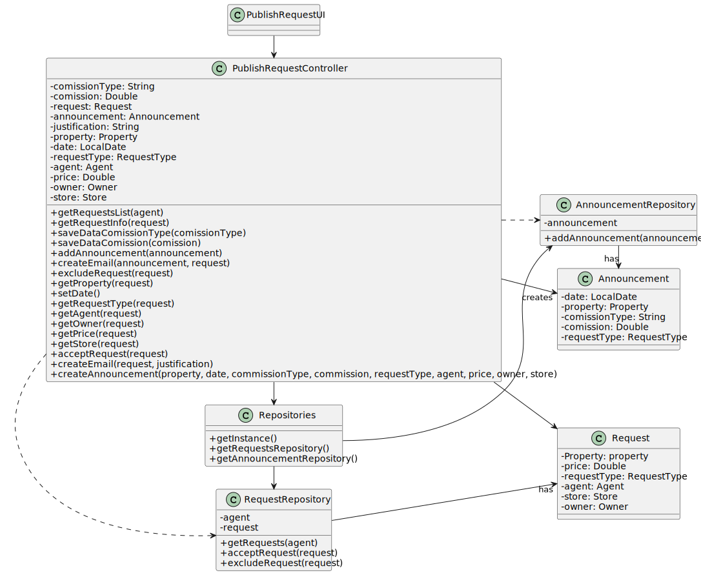

# US 002 - Publish a sale announcement

## 3. Design - User Story Realization 

### 3.1. Rationale

**SSD**

| Interaction ID                                                 | Question: Which class is responsible for... | Answer                         | Justification (with patterns)             |
|:---------------------------------------------------------------|:--------------------------------------------|:-------------------------------|:------------------------------------------|
| Step 1: Asks to see the list of property announcement requests | ... interacting with the user?              | RegisterAnnouncementUI         | Pure fabrication                          |
|                                                                | ... coordinating with the US?               | RegisterAnnouncementController | Controller                                |
|                                                                | ... initiating a new announcement?          | Repositories                   | Creator                                   |
|                                                                | ... get property type repository?           | Repository                     | Information Expert, Pure Fabrication      |
|                                                                | ... get property type list?                 | RequestsRepository             | Information Expert, Pure Fabrication      |
| Step 2: Shows the list of property announcement requests       | ... displaying the list?                    | RegisterAnnouncementUI         | IE : is responsible with user interaction |
| Step 3: Selects one of the property announcement requests      | ... set the answer?                         | RegisterAnnouncementController | IE : is responsible with user interaction |
| Step 4: Shows request and asks if they want to publish         | ... displaying the request?                 | RegisterAnnouncementUI         | IE : is responsible with user interaction |
| Step 5: Selects the option                                     | ... set the answer?                         | RegisterAnnouncementController | IE : is responsible with user interaction |
| Step 6: Requests comission type                                | ... set the answer?                         | RegisterAnnouncementUI         | IE : is responsible with user interaction |
| Step 7: Selects comission type                                 | ... verify is user is registed?             | RegisterAnnouncementController | Information Expert, Pure Fabrication      |
| Step 7: Requests comission                                     | ... get registed users repository?          | RegisterAnnouncementUI         | Information Expert, Pure Fabrication      |
| Step 8: Types comission                                        | ... get registed users list?                | RegisterAnnouncementController | Information Expert, Pure Fabrication      |
| Step 9: Shows all the data and asks for confirmation           | ... verify if user is registed?             | RegisterAnnouncementUI         | IE : is responsible with user interaction | 
| Step 10: Confirms publishment                                  | ... set the answer?                         | RegisterAnnouncementController | IE : is responsible with user interaction |
|                                                                | ... displaying the request?                 | Announcement                   | IE : is responsible with user interaction |
|                                                                | ... set the answer?                         | Announcement                   | IE : is responsible with user interaction |
|                                                                | ... displaying the request?                 | Announcement                   | IE : is responsible with user interaction |
|                                                                | ... set the answer?                         | RegisterAnnouncementController | IE : is responsible with user interaction |
|                                                                | ... displaying the request?                 | Repositories                   | IE : is responsible with user interaction |
|                                                                | ... set the answer?                         | Repository                     | IE : is responsible with user interaction |
|                                                                | ... displaying the request?                 | AnnouncementRepository         | IE : is responsible with user interaction |
|                                                                | ... set the answer?                         | RegisterAnnouncementController | IE : is responsible with user interaction |
| Step 11: Announcement created sucessfully                      | ... displaying the request?                 | RegisterAnnouncementUI         | IE : is responsible with user interaction |
| Step 12: Asks to type a justification                          | ... set the answer?                         | RegisterAnnouncementUI         | IE : is responsible with user interaction |
| Step 12: Types justification                                   | ... set the answer?                         | RegisterAnnouncementController | IE : is responsible with user interaction |
| Step 13: Shows all the data and asks for confirmation          | ... displaying the data?                    | RegisterAnnouncementUI         | IE : is responsible with user interaction |
| Step 14: Confirms information                                  | ... set the answer?                         | RegisterAnnouncementController | IE : is responsible with user interaction |
|                                                                | ... iniciate announcement?                  | Repositories                   | IE : is responsible with user interaction |
|                                                                | ... create announcement and set date?       | Repository                     | Creator                                   |
| Step 15: Request declined sucessfully                          | ... display sucess?                         | RequestRepository              | IE : is responsible with user interaction |

### Systematization ##

According to the taken rationale, the conceptual classes promoted to software classes are: 

 * Announcement
 * Repository
 * PropertyTypeRepository
 * RegistedUserRepository

Other software classes (i.e. Pure Fabrication) identified: 

 * RegisterAnnouncementUI  
 * RegisterAnnouncementController

## 3.2. Sequence Diagram (SD)

This diagram shows the full sequence of interactions between the classes involved in the realization of this user story.

## 3.3. Class Diagram (CD)

