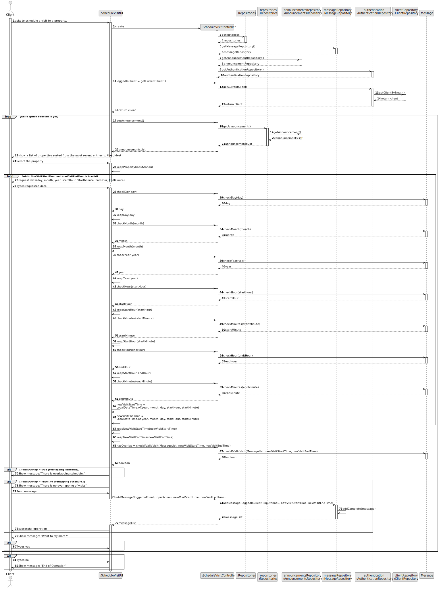

# US 009 - Leave a message to the agent to schedule a visit to a property.

## 3. Design - User Story Realization 

### 3.1. Rationale

**SSD - Alternative 1 is adopted.**

| Interaction ID | Question: Which class is responsible for...                       | Answer                         | Justification (with patterns)                          |
|:---------------|:------------------------------------------------------------------|:-------------------------------|:-------------------------------------------------------|
| Step 1  	      | asking to schedule a visit to a property?                         | ScheduleVisitUI                | Pure Fabrication                             |
| Step 2 	  	    | 	showing list of available properties?                            | ScheduleVisitController        | Controller                                       |
| Step 3		       | 	selecting property?                                              | ScheduleVisitUI                | Pure Fabrication                              |
| Step 4  	      | 	requesting data: date and time slot for the property visi?		 	 	 | ScheduleController             |       Controller                                          |
| Step 5  	      | 	Typing request data (date, time slot)?                           | ScheduleVisitUI                |   Pure Fabrication   |
| Step 6         | 	Informing operation sucess                                       | ScheduleVisitUI                |  Pure Fabrication  |
| Step 7         | 	Informing overlapping schedule                                   | ScheduleVisitUI                |  Pure Fabrication  |

### Systematization ##

According to the taken rationale, the conceptual classes promoted to software classes are: 

 * Announcement
 * Message
 * User

Other software classes (i.e. Pure Fabrication) identified: 

 * ScheduleVisitUI
 * ScheduleVisitController

## 3.2. Sequence Diagram (SD)

### Alternative 1 - Full Diagram

This diagram shows the full sequence of interactions between the classes involved in the realization of this user story.

## 3.3. Class Diagram (CD)

