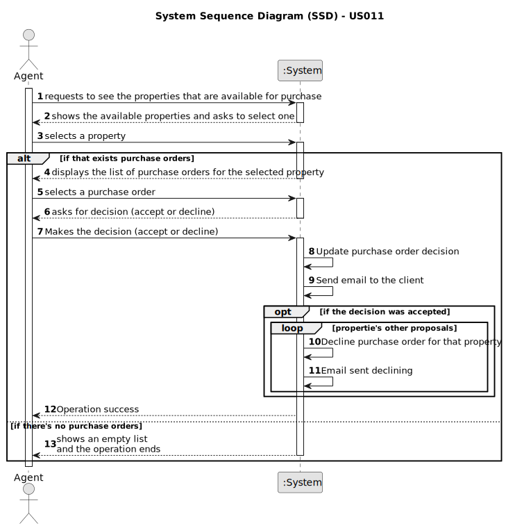

# US 011 -  To list real estate purchase orders

## 1. Requirements Engineering

### 1.1. User Story Description

As an agent, I want to list real estate purchase orders to accept or decline a
purchase order for a property. After accepting or declining, an email notification
should be sent to the customer.

### 1.2. Customer Specifications and Clarifications 

**From the specifications document:**

>   When the client decides to buy/rent the property, he sends a request for the purchase/lease of the
property to the agent. After being appreciated by the agent, he accepts or rejects the order. If the
request is accepted, the offer will not be shown again to clients using the application.

**From the client clarifications:**

5th May

> **Question:** When the agent declines an order, she has to be removed from the list and system?

> **Answer:** The order should be removed from the list but not from the system.

9th May

> **Question:** Regarding US011 should we provide all the property characteristics to assist agents in choosing the appropriate purchase order? If so, is it required to display the amount established by the property owner?

> **Answer:** Yes. Yes.

> **Question:**  When the agent wants to list real estate purchase orders, does he/she list all of them at once or can a property be chosen to list the purchase orders that are related to that specific property?
> 
> **Answer:** The properties should be sorted from the oldest to the most recent one. For each property, the list of purchase orders should be sorted by the amount offered, the highest offer must appear first.

16th May 

> **Question:**  The notification should be sent to the client, but we need to consider this client the owner or the potential buyer?

> **Answer:**  The client is the registered user that placed the order (in US10).
 
> **Question:** Assuming the previous anwser is the potential buyer, should the owner be informed about the sale success?

> **Answer:**  The owner will be contacted by means of a phone call. This is not a feature of the system.

### 1.3. Acceptance Criteria

* **AC1:** The list of purchase orders should be grouped by property. The properties
  should be sorted from the oldest to the most recent one. For each property, the
  list of purchase orders should be sorted by the amount offered, the highest offer
  must appear first.

* **AC2:** For each offer, the agent must be able to accept or decline it. The action of
  accepting or declining an offer should trigger an email notification to the client.

* **AC3:** When a purchase order is accepted, all the other orders should be declined,
  and a message sent to the client.

* **AC4:** If a property does not contain any offers, the system should show an empty
  list of offers.

### 1.4. Found out Dependencies
* (US003) There is a dependency because to publish an offer the agent needs to be registered by the system administrator.
* (US004) There is a dependency because the listed property by the owner needs to be valid.
* (US010) There is a dependency on "As a client, I place an order to purchase the property, submitting the order amount" because the agent needs the customer to place the order to buy a property and decide whether to accept or reject it.

### 1.5 Input and Output Data

**Input Data:**

* Typed data:
	* Accept or reject an order
	
* Selected data:
	*  property
    *  purchase order

**Output Data:**
* Email informing about the decision of the agent
* Success of the operation

### 1.6. System Sequence Diagram (SSD)

**Other alternatives might exist.**

#### Alternative One

### 1.7 Other Relevant Remarks

*  There are no other relevant remarks. 