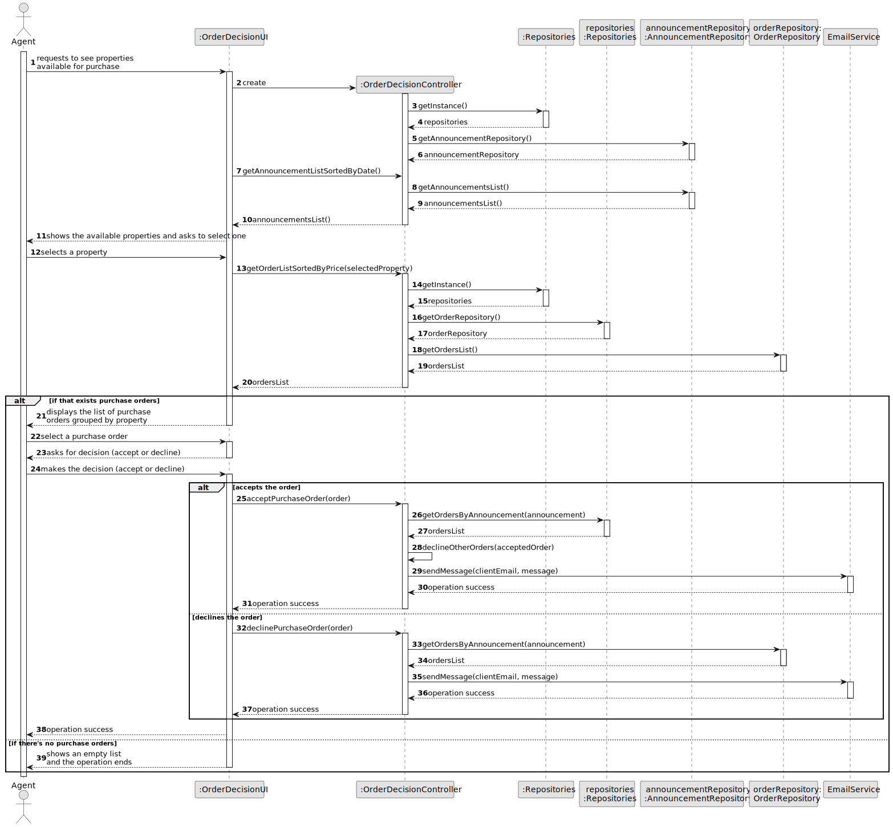
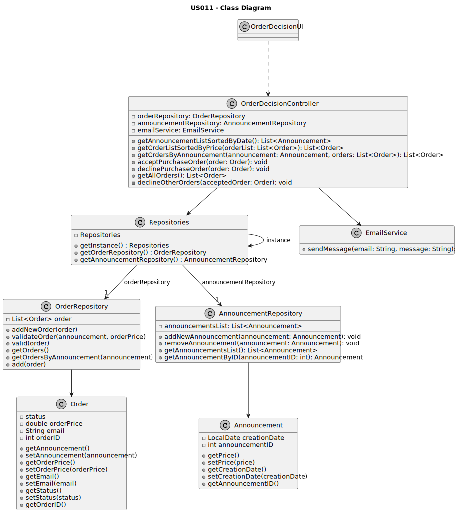

# US 011 - To list real estate purchase orders to accept or decline a purchase order for a property 

## 3. Design - User Story Realization 

### 3.1. Rationale

| Interaction ID                                                         | Question: Which class is responsible for...                          | Answer                  | Justification (with patterns) |
|:-----------------------------------------------------------------------|:---------------------------------------------------------------------|:------------------------|:------------------------------|
| Step 1 : requests to see properties that are available for purchase 		 | 	... displaying the purchase order list?                             | OrderDecisionUI         | Pure Fabrication              |
| Step 2 : displays the list of purchase orders grouped by property 		   | 	...have the property that is connected to the purchase order?						 | AnnouncementRepository  | Information Expert            |
| Step 3 : selects a purchase order 		                                   | 	...Keep the chosen purchase order temporarily?                      | OrderDecisionUI         | Pure Fabrication              |
| Step 4 : asks for decision(accept or decline) 		                       | 	                                                                    |                         |                               |
| Step 5 : makes the decision (accept or decline) 		                     | ..Keep the response to the purchase order temporarily?               | OrderDecisionUI         | Pure Fabrication              |
| Step 6 : Update purchase order decision                                | ...responsible for having the list always updated                    | OrderRepository         | Information Expert            |
| Step 7 : Send email to the client                                      | ...Sending email to the client                                       | EmailService            | Pure Fabrication              |
| Step 8 : Decline purchase order for that property                      | ...Displaying the button to decline or accept?                       | OrderDecisionUI         | Pure Fabrication              |
| Step 9 : Email sent declining                                          | ...Sending email to the client                                       | EmailService            | Pure Fabrication              |
| Step 6 : operation success  		                                         | 	...knowing the operation success?						                             | OrderDecisionController |                               | Pure Fabrication      |                     
| Step 7 : shows an empty list and the operation ends 		                 |                                                                      | OrderDecisionUI         | Pure Fabrication              | 

### Systematization ##

According to the taken rationale, the conceptual classes promoted to software classes are: 

 * Agent
 * OrderRepository

Other software classes (i.e. Pure Fabrication) identified: 

 * OrderDecisionUI  
 * OrderDecisionController

## 3.2. Sequence Diagram (SD)

This diagram shows the full sequence of interactions between the classes involved in the realization of this user story.

## 3.3. Class Diagram (CD)

