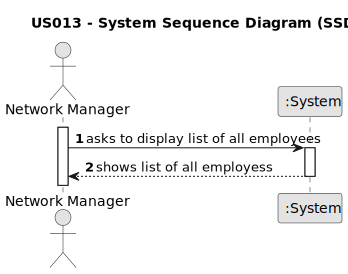

# US 013

## 1. Requirements Engineering

### 1.1. User Story Description

As a network manager, I want to list all employees working in every store of the network

### 1.2. Customer Specifications and Clarifications 

**From the specifications document:**

> The real estate agent reviews advertisement requests (...) it is **visible to all clients** who visit the agency and use the application.

> All registered information, except the agency commission, can be accessed by the client who intends to buy or rent the property.

**From the client clarifications:**

> **Question: (09/05/2023)**  Do you want a list where the header is ID, the name of the store, and the total number of listings that the store has?
>  
> **Answer:** Yes.

> **Question: (09/05/2023)**  And the alphabetical list of employees of that store repeated from the store with the most property listings to the one with the least property listings?
>  
> **Answer:** The answer to this question is to read carefully the acceptance criteria for this US and discuss them with your team...

### 1.3. Acceptance Criteria

**AC1:** The list of employee should be alphabetically sorted and grouped by store.

**AC2:** Stores should be sorted according to their property listings, from the one with more listings .

**AC3:** Each store should state how many property listings it has.

### 1.4. Found out Dependencies

* There could be a dependency in US002 since publishing a sale announcement would eventually require the listed properties to be shown.

### 1.5 Input and Output Data

**Input Data:**

* Typed data:
	* parish
    * price
* Selected data:
	* sale/rental
	* area
	* distance from center
	* price
	* property type
		* apartment
			* number of bedrooms
			* number of bathrooms
			* number of parking spaces
			* available equipment
		* house
			* number of bedrooms
			* number of bathrooms
			* number of parking spaces
			* available equipment
			* existence of a sun exposure
			* existence of a basement
			* existence of an inhabitable loft

**Output Data:**

* Listed properties that correspond to the inserted data or (by default) from most recently added.

### 1.6. System Sequence Diagram (SSD)

### 1.7 Other Relevant Remarks