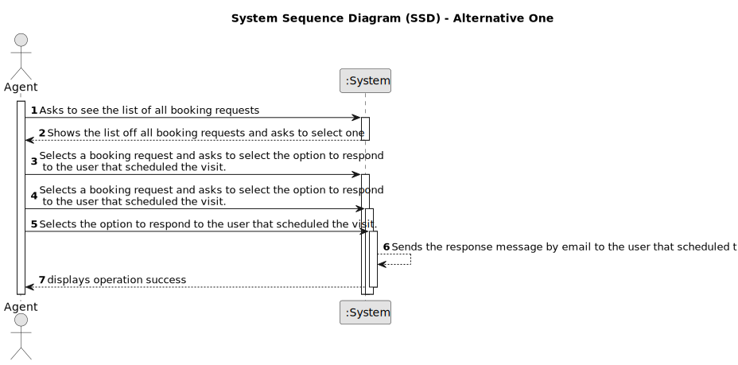

# US 016

## 1. Requirements Engineering

### 1.1. User Story Description

As an agent, when viewing a booking request, I want to respond to the user that scheduled the visit.

### 1.2. Customer Specifications and Clarifications 

**From the specifications document:**

> After consulting a list of properties, the client can request to schedule a visit to the real estate agent for a specific property to verify its conditions. The agent receives the request, checks the availability and sends the response. If the customer accepts the order, it is automatically scheduled
in the system.

**From the client clarifications:**

1st June 

> **Question:** In AC2, what is DEI's email service? Are you referring to Outlook?
> 
> **Answer:** Different email services can send the message. These services must be configured using a configuration file to enable using different platforms (e.g.: gmail, DEI's email service, etc.). DEI email service is an email service like gmail or Outlook. These are only examples, and you should prepare your system to support any email service.

> **Question:** When the agent is responding to the user that created the request, what should the answer be? Because accepting or declining the request is already done in US011.
> 
> **Answer:**  In US11 the agent wants to accept or decline a purchase order for a property. In US16 the agent wants to answer visit requests.
Please discuss the requirements with your team and professors before making a question.

> **Question:** When the agent requests the booking requests list to contact the client, that list should ONLY contain the requests related to that agent?
> 
> **Answer:** Yes. Listing is a feature described in US15.
Important: In US15 the Agent gets a list of booking requests (made to him). Then, the agent, may want to respond to the user (as defined in US16). US15 and US16 are executed sequentially. Even so, the agent should be able to see a list of all booking requests made to him (US15) without answer any booking request.

> **Question:** Our team is having trouble understanding US016's AC2. Until now, the email has been sent in the form of a text file, however, with this AC, a configuration file that allows the use of different platforms has been introduced. How should the sending of emails be carried out then?
> 
> **Answer:** The configuration file defines the email service to be used. The URI of the email service should be defined in the configuration file. The URI can be the path of a file. Please discuss this question with your ESOFT teatchers.

2nd June 

> **Question:**  In this US16, will it be necessary : save the message for could be in future list in the application or for audit action or isn´t necessary save, is only to send and the complete message (email) will not be auditable not even possible consult in the application in the future?
>  
> **Answer:** The system should record typed text messages. Regarding other messages, that only use information that is already registered in the system, the system should only record that the message was sent.

7th June 

> **Question:**  The US15 does the listing and in US16 we are already responding to one booking request. That said, were is the selection part being done?
>  
> **Answer:** In US15 the Agent gets a list of booking requests (made to him). Then, the agent, may want to respond to the user (as defined in US16). US15 and US16 are executed sequentially. Even so, the agent should be able to see a list of all booking requests made to him (US15) without answer any booking request. In US16 the agent selects the booking request.

9th June 

> **Question:** Should the email with the reply be sent as a file, for example txt, or should it be sent as an email?
> 
> **Answer:** You should send/write the e-mail message to a file named email.txt. All e-mails to be send should be written to this file. We will not use real world e-mail services and this file is used to replace the real world e-mail services.

> **Question:** What should be the difference between Gmail and Dei email service?
> 
> **Answer:** These services must be configured using a configuration file to enable using different platforms. Please study ESOFT and discuss these questions with your ESOFT teachers.

12th June

> **Question:** Regarding the AC4, it is stated "The response should include the property identification and location.". Is the property identification the same as the location? If not, how should we handle it in the legacy file since there isn't a specific column for each?
> 
> **Answer:** The response should include only the property location. US16 is not related with the legacy file!!! I think you have to study a little more ESOFT!

> **Question:** To send an email, we must have a configuration file with the data: host, port, user, password, in which, the host will have a URL or a path to the text file, or should we have only the host field?
> 
> **Answer:** In the configuration file you should only define the email service name (example: gmail) and the host address. The host address is a URI. As students did not take a course where they learn how to setup and use and email server, the URI to use is the path to the local email.txt file. All email messages must be written to this file.

### 1.3. Acceptance Criteria

**AC1:** The response is sent by email.

**AC2:** Different email services can send the message. These services must be configured using a configuration file to enable using different platforms

**AC3:** The response should include the name and phone number of the responsible Agent.

**AC4:** The response should include the property identification and location. 

**AC5:** When an Agent responds to a booking request the list of booking requests should be updated to not show this request.

### 1.4. Found out Dependencies

* There are dependencies with US015. In US15 the Agent gets a list of booking requests (made to him). Then, the agent, may want to respond to the user (as defined in US16). US15 and US16 are executed sequentially. Even so, the agent should be able to see a list of all booking requests made to him (US15) without answer any booking request. In US16 the agent selects the booking request.

### 1.5 Input and Output Data

**Input Data:**

* Typed data:
	
* Selected data:
	* booking request 
	* option to respond to the user that scheduled the visit

**Output Data:**

* Message by email

### 1.6. System Sequence Diagram (SSD)

### 1.7 Other Relevant Remarks