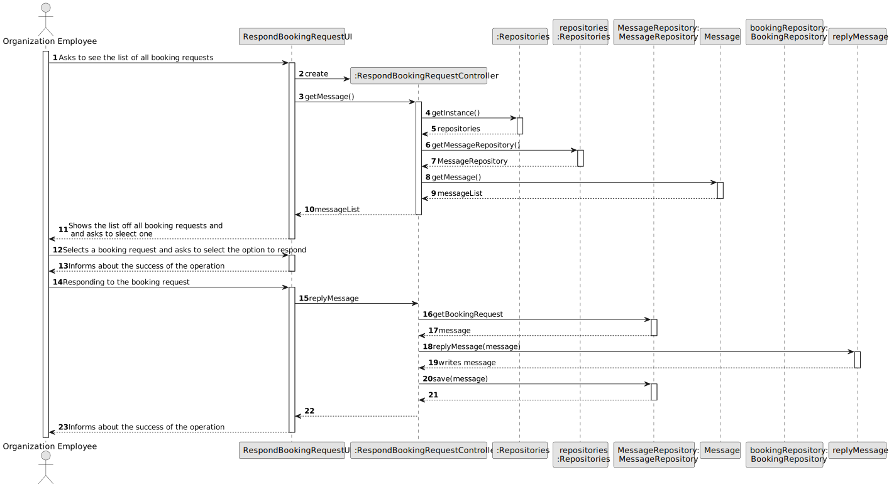
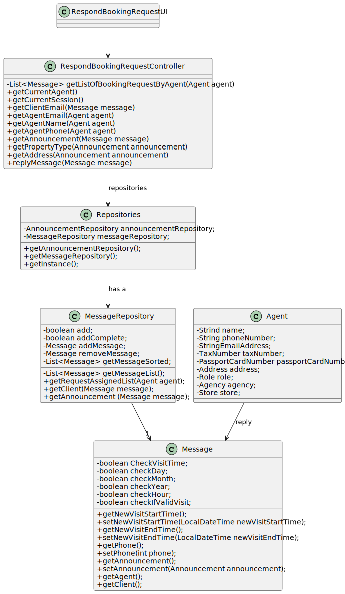

# US 016 - Display Listed Properties

## 3. Design - User Story Realization

### 3.1. Rationale

**SSD - Alternative 1 is adopted.**

| Interaction ID                                                | Question: Which class is responsible for...        | Answer                          | Justification (with patterns)     |
|:--------------------------------------------------------------|:---------------------------------------------------|:--------------------------------|:----------------------------------|
| Step 1: Ask to view a visit/booking request                   | 	... interacting with the actor?                   | RespondBookingRequestUI         | Pure Fabrication                  |
|                                                               | 	... coordinating the US?                          | RespondBookingRequestController | Controller                        |
| Step 3: Selects a visit request   		                          | 	... displaying booking requests?                  | RespondBookingRequestUI         | Pure Fabrication                  |
| Step 4: Display email services list                           | ... displaying the UI for the actor to input data? | RespondBookingRequestUI         | Pure Fabrication                  |
| Step 5: Selects an email service   		                         | 	... validating selected data?                     | RespondBookingRequestUI         | Pure Fabrication                  |
| Step 6: Asks to write a message                               | ... displays message to write a message            | RespondBookingRequestUI         | Pure Fabrication                  |
| Step 7: Compose a response with requested data  		            | 	... validating input data?                        | RespondBookingRequestUI         | Pure Fabrication                  |
| Step 8: Display email sent confirmation 		                    | ... displaying filtered list?                      | RespondBookingUI                | Pure Fabrication                  |                                                    | ... displaying sorted list?                                                               | DisplayPropertiesUI         | Pure Fabrication                                                                                              |

### Systematization ##

According to the taken rationale, the conceptual classes promoted to software classes are:

* Message 

Other software classes (i.e. Pure Fabrication) identified:

* RespondBookingRequestUI
* RespondBookingRequestController

## 3.2. Sequence Diagram (SD)

### Alternative 1 - Full Diagram

This diagram shows the full sequence of interactions between the classes involved in the realization of this user story.

## 3.3. Class Diagram (CD)

