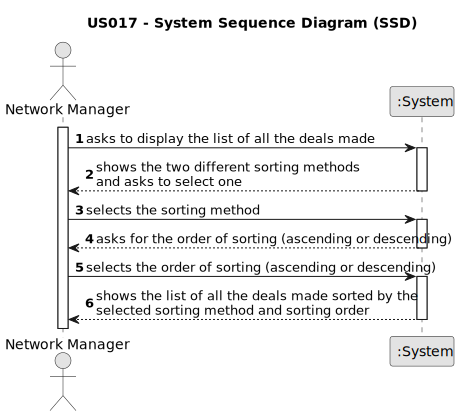

# US 017 - To list all deals made

## 1. Requirements Engineering

### 1.1. User Story Description

As a network manager, I want to list all deals made.

### 1.2. Customer Specifications and Clarifications 

**From the specifications document:**

> Each store in the network has a store manager and the set of stores is managed by a store network
manager. The main functions of a store manager are to monitor and streamline the branch with the
aim of getting to know better the business carried out and to analyse and evaluate the performance
of employees.
>
>
>The manager of the network intends to analyse the performance of each of the branches and the
global behaviour of the network on a daily basis.

**From the client clarifications:**

> **Question: (29/05/2023)** In this User Story it is requested that "All deals made" are listed. Are these deals just accepted purchase requests, or are declined purchase requests also included?
>  
> **Answer:** 

> **Question: (29/05/2023)** What should be the default order of the deals when displaying them to the network manager?
>  
> **Answer:** 

### 1.3. Acceptance Criteria

**AC1:** The actor should be able to sort all properties by property area (square feet) in descending/ascending order.

**AC2:** Two sorting algorithms should be implemented (to be chosen manually by the network manager).

**AC3:** Worst-case time complexity of each algorithm should be documented in the application user manual that must be delivered with the application (in the annexes, where algorithms should be written in pseudocode).

### 1.4. Found out Dependencies

* There could be a dependency in US002 since it´s fundamental that exists announcements in order to have deals made;
* There could be a dependency in US010 since it´s fundamental that exists purchase orders for an announced property;
* There could be a dependency in US011 since it´s fundamental that the agent accepts a purchase order in order to make the deal;

### 1.5 Input and Output Data

**Input Data:**

* Selected data:
   * sorting algorithm;
   * sorting order (ascending/descending);

**Output Data:**
   * List of deals made sorted by the property area in the selected order(ascending/descending));

### 1.6. System Sequence Diagram (SSD)

