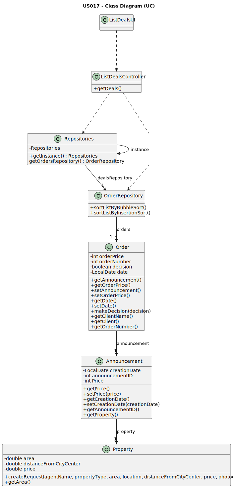

# US 017 - To list the deals 

## 3. Design - User Story Realization 

### 3.1. Rationale

| Interaction ID                                                                                             | Question: Which class is responsible for...         | Answer              | Justification (with patterns)                                                                                  |
|:-----------------------------------------------------------------------------------------------------------|:----------------------------------------------------|:--------------------|:---------------------------------------------------------------------------------------------------------------|
| Step 1 : asks to list all the deals made                                                                   | 	... interacting with the actor?                    | ListDealsUI         | Pure Fabrication : there is no reason to assign this responsibility to any existing class in the Domain Model. |
| 	                                                                                                          | 	... coordinating the US?                           | ListDealsController | Controller                                                                                                     |
| Step 2 : shows the two different sorting methods (Bubble Sorting or Insertion Sort) and asks to select one | 	... displaying the list of deals?                  | ListDealsUI         | Pure Fabrication                                                                                               |
|                                                                                                            | ... getting the deals made?                         | ListDealsController | Controller                                                                                                     |
|                                                                                                            | ... having the deals made?                          | OrderRepository     | IE : all the orders that where accepted by the agent                                                           |
|                                                                                                            | ... requesting the sorting method?                  | ListDealsUI         | Pure Fabrication                                                                                               |
| Step 3 : selects the sorting method (Bubble Sorting or Insertion Sort) 		                                  | 	... reading and validating the response? 					     | ListDealsUI         | Pure Fabrication                                                                                               |
| Step 4 : asks for the order of sorting (ascending or descending)                                           | ... requesting the sorting order?                   | ListDealsUI         | Pure Fabrication                                                                                               |                                                                                                           |||
| Step 5 : selects the order of sorting (ascending or descending)                                            | ... reading and validating the response?					       | ListDealsUI         | Pure Fabrication                                                                                               |
|                                                                                                            | ... asking to sort the list?                        | ListDealsController | Controller                                                                                                     |
|                                                                                                            | ... sorting the list by the area of the properties? | OrderRepository     | IE : all the orders that were accepted by the agent                                                            |
|                                                                                                            | ... getting the announcements with accepted orders? | Order               | IE : owns its data                                                                                             |
|                                                                                                            | ... getting the properties announced?               | Announcement        | IE : owns its data                                                                                             |
|                                                                                                            | ... getting the area of the property?               | Property            | IE : owns its data                                                                                             |
| Step 6 : shows the list of all the deals made sorted by the selected sorting method and order              | ... displaying the sorted list of deals?            | ListDealsUI         | Pure Fabrication                                                                                               |

### Systematization ##

According to the taken rationale, the conceptual classes promoted to software classes are: 

 * Order
 * Announcement
 * Property

Other software classes (i.e. Pure Fabrication) identified: 

 * ListDealsUI
 * ListDealsController

## 3.2. Sequence Diagram (SD)

This diagram shows the full sequence of interactions between the classes involved in the realization of this user story.

## 3.3. Class Diagram (CD)

