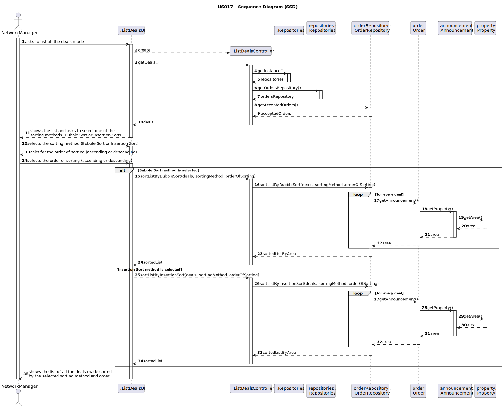
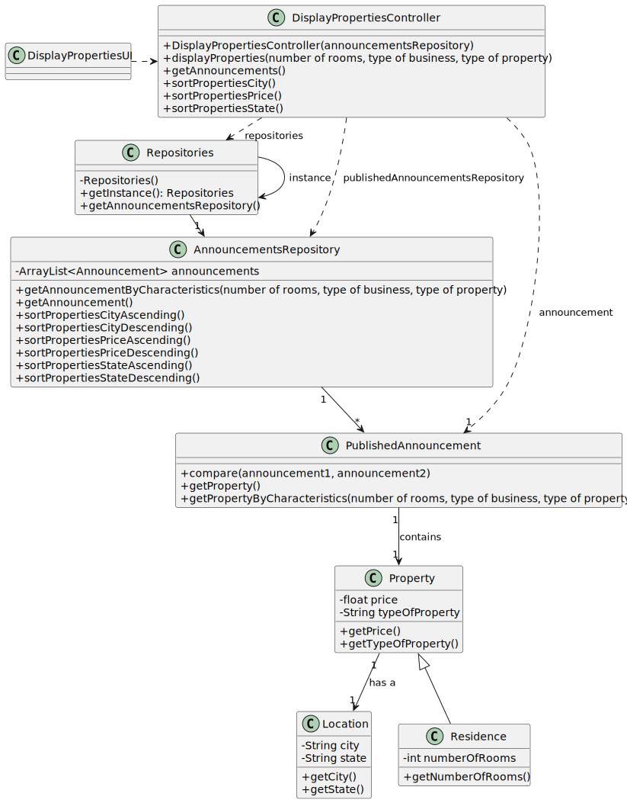

# US 013 - To create a Task 

## 3. Design - User Story Realization 

### 3.1. Rationale

**SSD - Alternative 1 is adopted.**

| Interaction ID | Question: Which class is responsible for... | Answer                 | Justification (with patterns)                                                                                 |
|:---------------|:--------------------------------------------|:-----------------------|:--------------------------------------------------------------------------------------------------------------|
| Step 1  		     | 	... interacting with the actor?            | ListEmployeeUI         | Pure Fabrication: there is no reason to assign this responsibility to any existing class in the Domain Model. |
| 			  		        | 	... coordinating the US?                   | ListEmployeeController | Controller                                                                                                    |
| 			  		        | 	... list all employees from a store?       | EmployeeRepository     | The repository has the data of all the employees working on all stores of the network.                        |
|                          |                                             |                        |                                                                                                               |
| Step 2  		     | 	...asks for the information					           | Network Manager        | The network Manager has access to all the data about every employee.                                          |

### Systematization ##

According to the taken rationale, the conceptual classes promoted to software classes are: 

 * Employee
 * Store

Other software classes (i.e. Pure Fabrication) identified: 

 * ListEmployeeUI
 * ListEmployeeController 
 

## 3.2. Sequence Diagram (SD)

### Alternative 1 - Full Diagram

This diagram shows the full sequence of interactions between the classes involved in the realization of this user story.

## 3.3. Class Diagram (CD)

