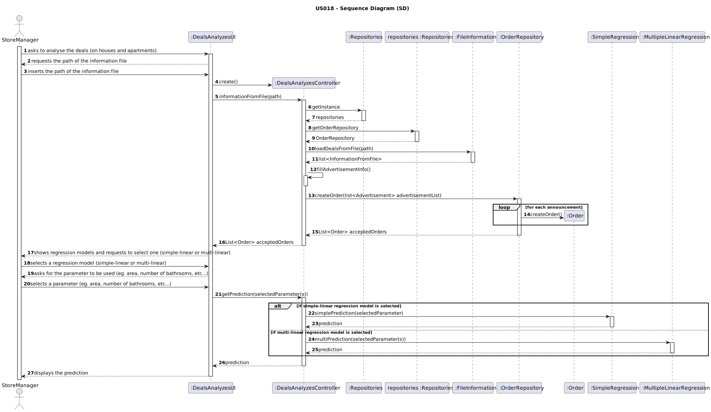
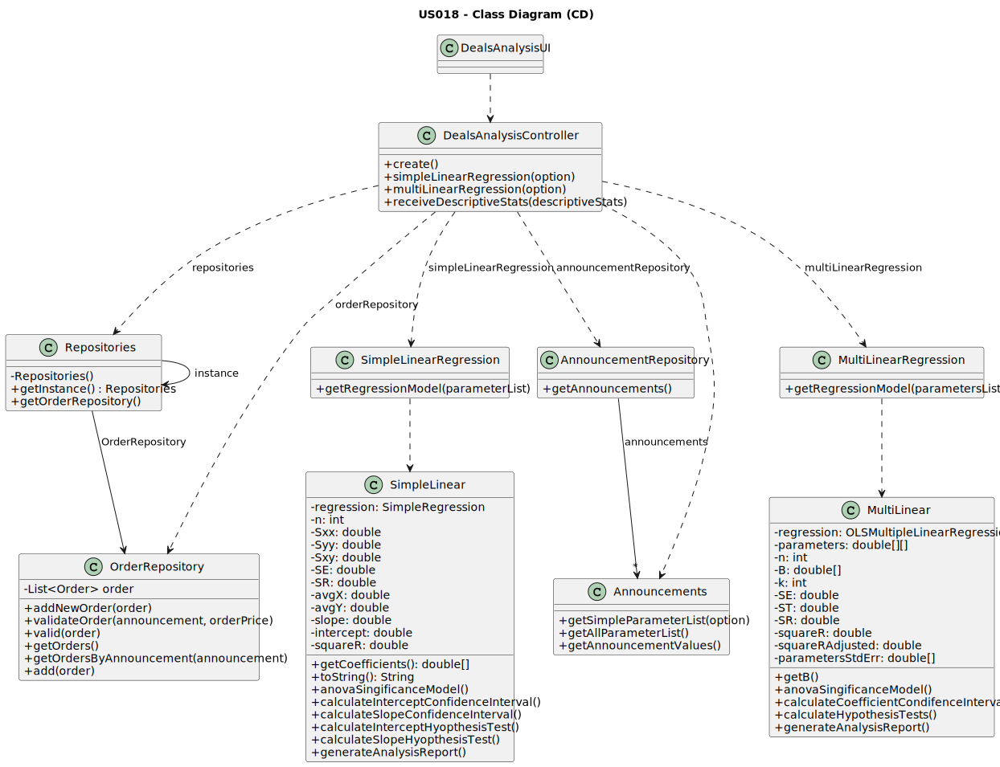

# US 019 - As a store manager, I intend to analyse the deals (only sale of houses and apartments) made.

## 3. Design - User Story Realization 

### 3.1. Rationale

| Interaction ID                                                                              | Question: Which class is responsible for...                  | Answer                                    | Justification (with patterns)                                                                                  |
|:--------------------------------------------------------------------------------------------|:-------------------------------------------------------------|:------------------------------------------|:---------------------------------------------------------------------------------------------------------------|
| Step 1 : asks to analyse the deals (on houses and apartments)                               | 	... interacting with the actor?                             | DealsAnalyzesUI                           | Pure Fabrication : there is no reason to assign this responsibility to any existing class in the Domain Model. |
| 	                                                                                           | 	... coordinating the US?                                    | DealsAnalyzesController                   | Controller                                                                                                     |
| Step 2 : requests the path of the information file                                          | 	... requesting the file path?                               | DealsAnalyzesUI                           | Pure Fabrication                                                                                               |
| Step 3 : inserts the path of the information file 		                                        | 	... reading and validating the response? 					              | DealsAnalyzesUI                           | Pure Fabrication                                                                                               |
| Step 4 : shows regression models and requests to select one (simple-linear or multi-linear) | ... requesting the regression method?                        | DealsAnalyzesUI                           | Pure Fabrication                                                                                               |                                                                                                           |||
| Step 5 : selects a regression model (simple-linear or multi-linear)                         | ... reading and validating the response?					                | DealsAnalyzesUI                           | Pure Fabrication                                                                                               |
|                                                                                             | ... getting the orders from the information file?            | DealsAnalyzesController                   | Controller                                                                                                     |
|                                                                                             | ... keeping the orders extracted from the information file ? | OrderRepository                           | IE : all the orders that were imported from the file                                                           |
|                                                                                             | ... getting the announcements with accepted orders?          | Order                                     | IE : owns its data                                                                                             |
| Step 6 : asks for the parameter to be used (eg. area, number of bathrooms, etc...)          | ... requesting the parameters to be used?                    | DealsAnalyzesUI                           | Pure Fabrication                                                                                               |
| Step 7 : selects a parameter (eg. area, number of bathrooms, etc...)                        | ... reading and validating the response?	                    | DealsAnalyzesUI                           | Pure Fabrication                                                                                               |
| Step 8 : displays the prediction                                                            | ... getting the prediction?                                  | DealsAnalyzesController                   | Controller                                                                                                     |
|                                                                                             | ... calculating the prediction?                              | SimpleRegression/MultipleLinearRegression | IE : owns its data                                                                                             |
|                                                                                             | ... displaying the prediction?                               | DealsAnalyzesUI                           | Pure Fabrication                                                                                               |

### Systematization ##

According to the taken rationale, the conceptual classes promoted to software classes are: 

 * Order
 * SimpleRegression
 * MultipleLinearRegression

Other software classes (i.e. Pure Fabrication) identified: 

 * DealsAnalyzesUI
 * DealsAnalyzesController

## 3.2. Sequence Diagram (SD)

This diagram shows the full sequence of interactions between the classes involved in the realization of this user story.

## 3.3. Class Diagram (CD)

