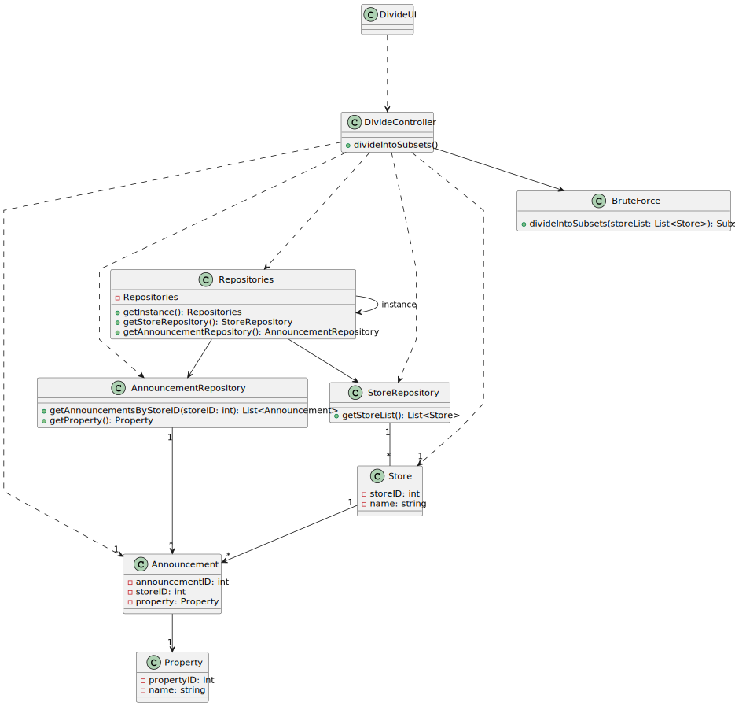

# US 019 - I want to divide the set of all stores into two subsets 

## 3. Design - User Story Realization 

### 3.1. Rationale

| Interaction ID                                                                                  | Question: Which class is responsible for...                                                     | Answer           | Justification (with patterns)                                                                                  |
|:------------------------------------------------------------------------------------------------|:------------------------------------------------------------------------------------------------|:-----------------|:---------------------------------------------------------------------------------------------------------------|
| Step 1 : asks to divide the set of all stores into two subsets                                  | 	... interacting with the actor?                                                                | DivideUI         | Pure Fabrication : there is no reason to assign this responsibility to any existing class in the Domain Model. |
| 	                                                                                               | 	... coordinating the US?                                                                       | DivideController | Controller                                                                                                     |
| Step 2 : displays the number of stores in the system and asks for confirmation                  | 	... displays the number of stores in the system and asks for confirmation?                     | DivideUI         | Pure Fabrication                                                                                               |
|                                                                                                 | ... getting the number of stores?                                                               | DivideController | Controller                                                                                                     |
|                                                                                                 | ... having the number of stores?                                                                | StoreRepository  | IE : all the registered stores                                                                                 |
| Step 3 : confirms the number of stores 		                                                       | 	... validating the response? 					                                                             | DivideUI         | Pure Fabrication                                                                                               |
| Step 4 : returns the run time algorithm, the list of stores in each subset and their difference | ... displaying the list of stores in each subset, their difference and the run time algorithm ? | DivideUI         | Pure Fabrication                                                                                               |

### Systematization ##

According to the taken rationale, the conceptual classes promoted to software classes are: 

 * BruceForceAlgorithm

Other software classes (i.e. Pure Fabrication) identified: 

 * DivideUI
 * DivideController

## 3.2. Sequence Diagram (SD)

This diagram shows the full sequence of interactions between the classes involved in the realization of this user story.

## 3.3. Class Diagram (CD)

